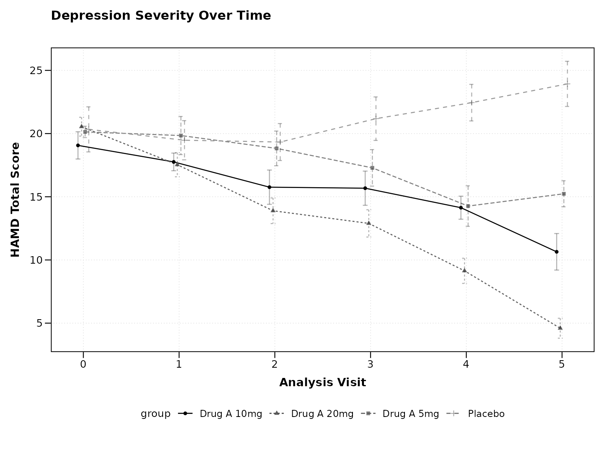
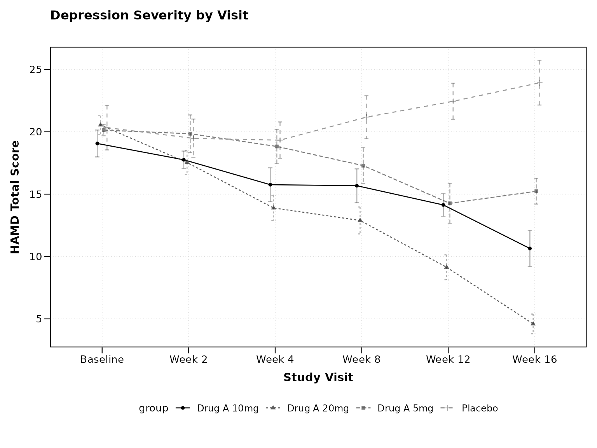
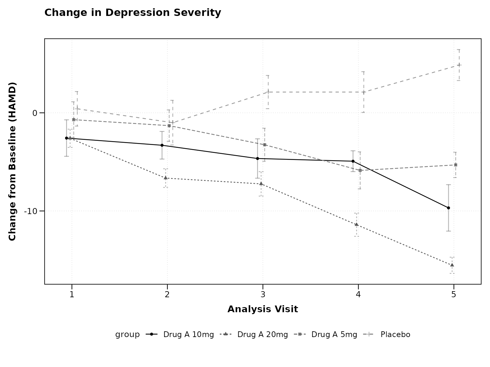
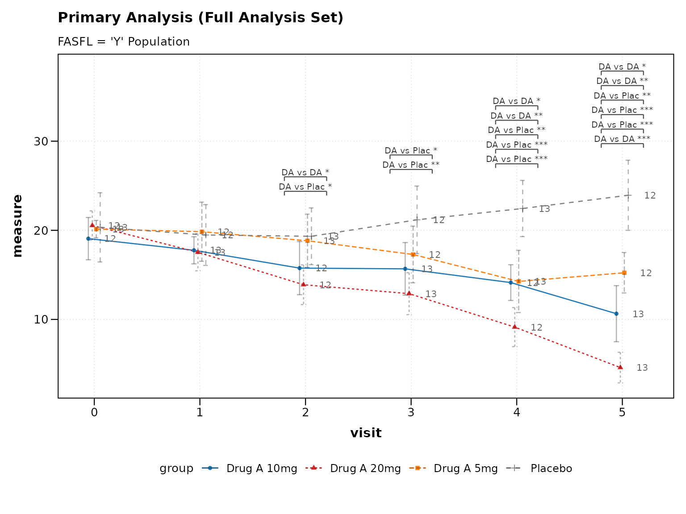
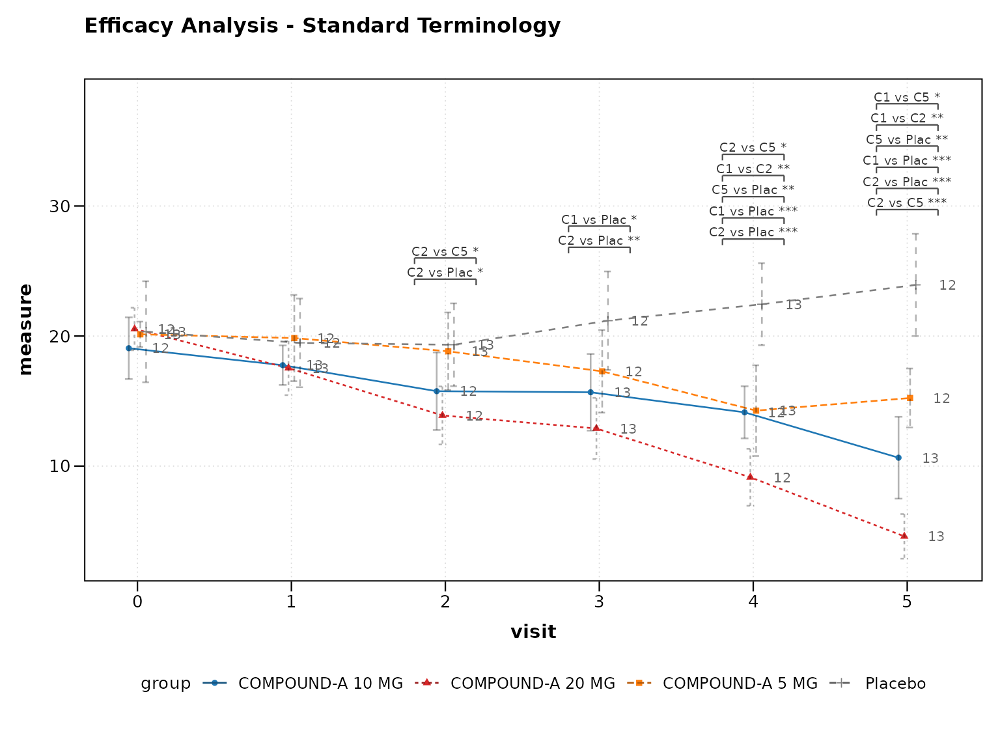
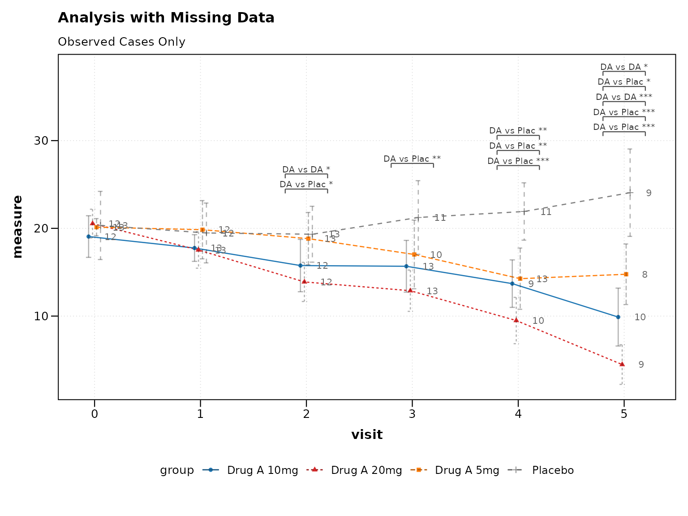
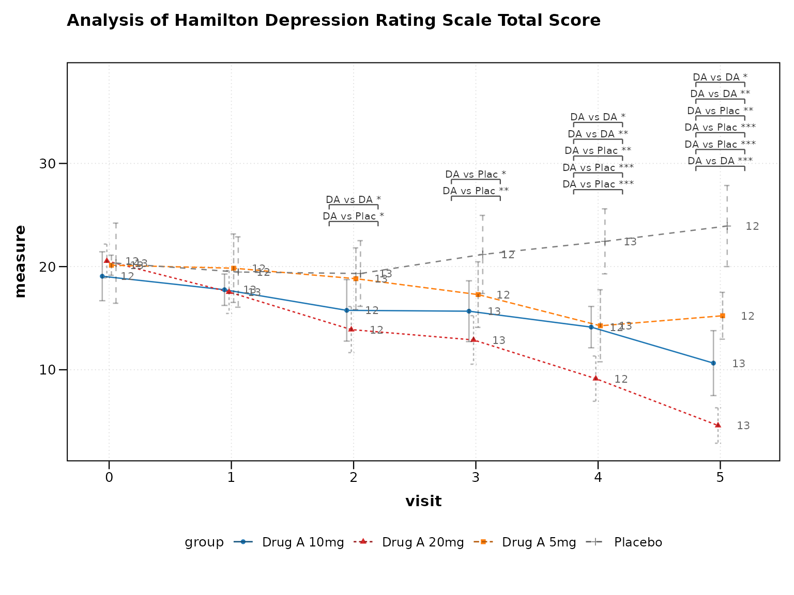

# CDISC Compliance and Standards

``` r

library(zzlongplot)
library(ggplot2)
library(dplyr)
#> 
#> Attaching package: 'dplyr'
#> The following objects are masked from 'package:stats':
#> 
#>     filter, lag
#> The following objects are masked from 'package:base':
#> 
#>     intersect, setdiff, setequal, union
```

## Introduction to CDISC Standards

The Clinical Data Interchange Standards Consortium (CDISC) provides
global standards for clinical research data. The `zzlongplot` package
includes built-in support for CDISC naming conventions and standards to
streamline clinical trial data visualization.

This vignette covers: - CDISC variable naming conventions - Automatic
variable detection and mapping - Compliance with ADaM (Analysis Data
Model) standards - Best practices for regulatory submissions

## CDISC Variable Naming Conventions

### Core Analysis Variables

CDISC defines standard variable names for clinical trial analysis:

| Variable    | Description                  | Example Values                    |
|-------------|------------------------------|-----------------------------------|
| **SUBJID**  | Subject Identifier           | “001-001”, “001-002”              |
| **USUBJID** | Unique Subject Identifier    | “STUDY001-001-001”                |
| **AVISITN** | Analysis Visit Number        | 0, 1, 2, 3, 4                     |
| **VISIT**   | Visit Name                   | “Screening”, “Baseline”, “Week 4” |
| **AVAL**    | Analysis Value               | Numeric endpoint values           |
| **CHG**     | Change from Baseline         | Calculated change values          |
| **PCHG**    | Percent Change from Baseline | Percentage change values          |
| **TRT01P**  | Planned Treatment            | “Placebo”, “Drug A”, “Drug B”     |
| **TRT01A**  | Actual Treatment             | “Placebo”, “Drug A”, “Drug B”     |
| **SAFFL**   | Safety Population Flag       | “Y”, “N”                          |
| **FASFL**   | Full Analysis Set Flag       | “Y”, “N”                          |

### Creating CDISC-Compliant Data

Let’s create a dataset following CDISC conventions:

``` r

# Create CDISC-compliant dataset
set.seed(456)

cdisc_data <- expand.grid(
  USUBJID = paste0("STUDY001-001-", sprintf("%03d", 1:50)),
  AVISITN = c(0, 1, 2, 3, 4, 5)  # Baseline + 5 visits
) |>
  mutate(
    # Subject identifier (shortened)
    SUBJID = sub("STUDY001-", "", USUBJID),
    
    # Visit information  
    VISIT = case_when(
      AVISITN == 0 ~ "Baseline",
      AVISITN == 1 ~ "Week 2", 
      AVISITN == 2 ~ "Week 4",
      AVISITN == 3 ~ "Week 8",
      AVISITN == 4 ~ "Week 12", 
      AVISITN == 5 ~ "Week 16"
    ),
    
    # Treatment assignments
    TRT01P = rep(c("Placebo", "Drug A 5mg", "Drug A 10mg", "Drug A 20mg"), 
                 length.out = n()),
    TRT01A = TRT01P,  # Assume planned = actual for simplicity
    
    # Population flags
    SAFFL = "Y",
    FASFL = "Y",
    
    # Analysis values - simulate depression rating scale (lower = better)
    AVAL = case_when(
      TRT01P == "Placebo" ~ pmax(0, rnorm(n(), mean = 20 + AVISITN * 0.5, sd = 5)),
      TRT01P == "Drug A 5mg" ~ pmax(0, rnorm(n(), mean = 20 - AVISITN * 1, sd = 4.5)),
      TRT01P == "Drug A 10mg" ~ pmax(0, rnorm(n(), mean = 20 - AVISITN * 2, sd = 4)),
      TRT01P == "Drug A 20mg" ~ pmax(0, rnorm(n(), mean = 20 - AVISITN * 3, sd = 4))
    ),
    
    # Parameter information
    PARAM = "Hamilton Depression Rating Scale Total Score",
    PARAMCD = "HAMDTOT"
  ) |>
  # Calculate change from baseline
  group_by(USUBJID) %>%
  mutate(
    BASE = AVAL[AVISITN == 0],
    CHG = ifelse(AVISITN == 0, NA, AVAL - BASE),
    PCHG = ifelse(AVISITN == 0, NA, (AVAL - BASE) / BASE * 100)
  ) |>
  ungroup() |>
  arrange(USUBJID, AVISITN)

head(cdisc_data, 10)
#> # A tibble: 10 × 14
#>    USUBJID    AVISITN SUBJID VISIT TRT01P TRT01A SAFFL FASFL  AVAL PARAM PARAMCD
#>    <fct>        <dbl> <chr>  <chr> <chr>  <chr>  <chr> <chr> <dbl> <chr> <chr>  
#>  1 STUDY001-…       0 001-0… Base… Place… Place… Y     Y      13.3 Hami… HAMDTOT
#>  2 STUDY001-…       1 001-0… Week… Drug … Drug … Y     Y      22.2 Hami… HAMDTOT
#>  3 STUDY001-…       2 001-0… Week… Place… Place… Y     Y      21.6 Hami… HAMDTOT
#>  4 STUDY001-…       3 001-0… Week… Drug … Drug … Y     Y      13.7 Hami… HAMDTOT
#>  5 STUDY001-…       4 001-0… Week… Place… Place… Y     Y      23.5 Hami… HAMDTOT
#>  6 STUDY001-…       5 001-0… Week… Drug … Drug … Y     Y      19.9 Hami… HAMDTOT
#>  7 STUDY001-…       0 001-0… Base… Drug … Drug … Y     Y      21.8 Hami… HAMDTOT
#>  8 STUDY001-…       1 001-0… Week… Drug … Drug … Y     Y      21.5 Hami… HAMDTOT
#>  9 STUDY001-…       2 001-0… Week… Drug … Drug … Y     Y      16.1 Hami… HAMDTOT
#> 10 STUDY001-…       3 001-0… Week… Drug … Drug … Y     Y      11.4 Hami… HAMDTOT
#> # ℹ 3 more variables: BASE <dbl>, CHG <dbl>, PCHG <dbl>
```

## Automatic CDISC Variable Recognition

### Basic CDISC Plot

The package automatically recognizes CDISC variable names:

``` r

# Automatic CDISC recognition
p1 <- lplot(
  cdisc_data,
  form = AVAL ~ AVISITN | TRT01P,
  cluster_var = "USUBJID",  # Uses USUBJID (standard)
  baseline_value = 0,
  xlab = "Analysis Visit",
  ylab = "HAMD Total Score",
  title = "Depression Severity Over Time"
)
#> Warning: The `size` argument of `element_line()` is deprecated as of ggplot2 3.4.0.
#> ℹ Please use the `linewidth` argument instead.
#> ℹ The deprecated feature was likely used in the zzlongplot package.
#>   Please report the issue at <https://github.com/rgt47/zzlongplot/issues>.
#> This warning is displayed once per session.
#> Call `lifecycle::last_lifecycle_warnings()` to see where this warning was
#> generated.
#> Warning: The `size` argument of `element_rect()` is deprecated as of ggplot2 3.4.0.
#> ℹ Please use the `linewidth` argument instead.
#> ℹ The deprecated feature was likely used in the zzlongplot package.
#>   Please report the issue at <https://github.com/rgt47/zzlongplot/issues>.
#> This warning is displayed once per session.
#> Call `lifecycle::last_lifecycle_warnings()` to see where this warning was
#> generated.

print(p1)
```



### Using VISIT Names

CDISC often uses descriptive visit names:

``` r

# Using CDISC visit names
p2 <- lplot(
  cdisc_data, 
  form = AVAL ~ VISIT | TRT01P,
  cluster_var = "USUBJID",
  baseline_value = "Baseline",
  xlab = "Study Visit", 
  ylab = "HAMD Total Score",
  title = "Depression Severity by Visit"
)

print(p2)
```



### Change from Baseline (CHG)

CDISC datasets typically include pre-calculated CHG values:

``` r

# Using pre-calculated CHG values
cdisc_chg <- cdisc_data %>% filter(AVISITN > 0)  # Exclude baseline for CHG

p3 <- lplot(
  cdisc_chg,
  form = CHG ~ AVISITN | TRT01P,
  cluster_var = "USUBJID", 
  baseline_value = 1,  # First post-baseline visit
  xlab = "Analysis Visit",
  ylab = "Change from Baseline (HAMD)",
  title = "Change in Depression Severity"
)

print(p3)
```



## CDISC Variable Detection Helper

### Suggest Clinical Variables

The package can automatically detect likely CDISC variables:

``` r

# Auto-detect CDISC variables
suggestions <- suggest_clinical_vars(cdisc_data)
#> CDISC Variable Detection Results:
#> =================================
#> 
#> Suggested Formula: AVAL ~ AVISITN | TRT01P 
#> Cluster Variable: USUBJID 
#> Baseline Value: 0 
#> 
#> Detected Variables:
#>   subject_id: USUBJID, SUBJID
#>   visit: AVISITN, VISIT
#>   analysis_value: AVAL
#>   treatment: TRT01P, TRT01A
#>   change: CHG, PCHG
#>   population: SAFFL, FASFL
print(suggestions)
#> $suggested_formula
#> [1] "AVAL ~ AVISITN | TRT01P"
#> 
#> $detected_vars
#> $detected_vars$subject_id
#>   primary secondary 
#> "USUBJID"  "SUBJID" 
#> 
#> $detected_vars$visit
#>   numeric character 
#> "AVISITN"   "VISIT" 
#> 
#> $detected_vars$analysis_value
#> primary 
#>  "AVAL" 
#> 
#> $detected_vars$treatment
#>  planned   actual 
#> "TRT01P" "TRT01A" 
#> 
#> $detected_vars$change
#> primary percent 
#>   "CHG"  "PCHG" 
#> 
#> $detected_vars$population
#>   safety efficacy 
#>  "SAFFL"  "FASFL" 
#> 
#> 
#> $cluster_var
#> [1] "USUBJID"
#> 
#> $baseline_value
#> [1] 0
#> 
#> $warnings
#> character(0)
```

### Validate CDISC Compliance

``` r

# Check CDISC compliance
compliance <- validate_cdisc_data(cdisc_data)
print(compliance)
#> $compliance_score
#> [1] 100
#> 
#> $score_breakdown
#> $score_breakdown$required_vars
#> [1] 25
#> 
#> $score_breakdown$subject_id
#> [1] 20
#> 
#> $score_breakdown$visit_vars
#> [1] 15
#> 
#> $score_breakdown$analysis_values
#> [1] 15
#> 
#> $score_breakdown$change_vars
#> [1] 10
#> 
#> $score_breakdown$treatment_vars
#> [1] 10
#> 
#> $score_breakdown$population_flags
#> [1] 5
#> 
#> 
#> $issues
#> character(0)
#> 
#> $recommendations
#> character(0)
#> 
#> $max_possible_score
#> [1] 100
#> 
#> $actual_score
#> [1] 100
```

## ADaM Standards Compliance

### Analysis Data Model (ADaM)

ADaM is the CDISC standard for analysis datasets. Key requirements
include:

#### 1. Required Variables

Every ADaM dataset should have: - **USUBJID**: Unique subject
identifier - **SUBJID**: Subject identifier within study - **STUDYID**:
Study identifier  
- **SITEID**: Site identifier

``` r

# Add ADaM required variables
cdisc_adam <- cdisc_data %>%
  mutate(
    STUDYID = "STUDY001",
    SITEID = substr(SUBJID, 1, 3)  # Extract site from SUBJID
  )

# Verify required variables
required_vars <- c("USUBJID", "SUBJID", "STUDYID")
cat("Required ADaM variables present:", 
    all(required_vars %in% names(cdisc_adam)), "\n")
#> Required ADaM variables present: TRUE
```

#### 2. Analysis Flags

ADaM datasets include population analysis flags:

``` r

# Population-specific analysis
fasfl_data <- cdisc_adam %>% filter(FASFL == "Y")

p4 <- lplot(
  fasfl_data,
  form = AVAL ~ AVISITN | TRT01P, 
  cluster_var = "USUBJID",
  baseline_value = 0,
  clinical_mode = TRUE,
  title = "Primary Analysis (Full Analysis Set)",
  subtitle = "FASFL = 'Y' Population"
)

print(p4)
```



#### 3. Traceability

ADaM requires traceability to source data:

``` r

# Add traceability variables (example)
cdisc_trace <- cdisc_adam %>%
  mutate(
    # Source dataset references
    SRCDOM = "QS",        # Source domain (Questionnaires)
    SRCVAR = "QSSTRESN",  # Source variable
    SRCSEQ = row_number() # Source sequence
  )
```

## Regulatory Submission Standards

### 1. Consistent Terminology

Use CDISC controlled terminology:

``` r

# CDISC controlled terminology for treatments
cdisc_terminology <- cdisc_adam |>
  mutate(
    TRT01P_STD = case_match(
      TRT01P,
      "Placebo" ~ "Placebo",
      "Drug A 5mg" ~ "COMPOUND-A 5 MG",
      "Drug A 10mg" ~ "COMPOUND-A 10 MG",
      "Drug A 20mg" ~ "COMPOUND-A 20 MG"
    )
  )
#> Warning: There was 1 warning in `mutate()`.
#> ℹ In argument: `TRT01P_STD = case_match(...)`.
#> Caused by warning:
#> ! `case_match()` was deprecated in dplyr 1.2.0.
#> ℹ Please use `recode_values()` instead.

p5 <- lplot(
  cdisc_terminology,
  form = AVAL ~ AVISITN | TRT01P_STD,
  cluster_var = "USUBJID",
  baseline_value = 0,
  clinical_mode = TRUE,
  title = "Efficacy Analysis - Standard Terminology"
)

print(p5)
```



### 2. Missing Data Handling

CDISC requires explicit missing data handling:

``` r

# Add some missing data patterns
cdisc_missing <- cdisc_adam %>%
  mutate(
    # Simulate missing data (dropout pattern)
    AVAL = ifelse(
      AVISITN >= 3 & runif(n()) < 0.1 * (AVISITN - 2), 
      NA, 
      AVAL
    )
  )

# Plot showing missing data impact
p6 <- lplot(
  cdisc_missing,
  form = AVAL ~ AVISITN | TRT01P,
  cluster_var = "USUBJID", 
  baseline_value = 0,
  clinical_mode = TRUE,
  title = "Analysis with Missing Data",
  subtitle = "Observed Cases Only"
)

print(p6)
```



## Best Practices for CDISC Compliance

### 1. Standard Variable Names

Always use CDISC standard variable names:

``` r

# Good: CDISC standard names
good_plot <- lplot(
  cdisc_data,
  form = AVAL ~ AVISITN | TRT01P,
  cluster_var = "USUBJID",
  baseline_value = 0
)

# Avoid: Non-standard names
# bad_plot <- lplot(data, score ~ week | treatment, cluster_var = "id")
```

### 2. Population Flags

Use analysis population flags appropriately:

``` r

# Safety population analysis
safety_data <- cdisc_adam %>% filter(SAFFL == "Y")

# Full analysis set
fas_data <- cdisc_adam %>% filter(FASFL == "Y") 

cat("Safety Population N =", length(unique(safety_data$USUBJID)), "\n")
#> Safety Population N = 50
cat("Full Analysis Set N =", length(unique(fas_data$USUBJID)), "\n")
#> Full Analysis Set N = 50
```

### 3. Parameter Standardization

Include standard parameter information:

``` r

# Check parameter consistency
params <- cdisc_data %>%
  select(PARAM, PARAMCD) %>%
  distinct()

print(params)
#> # A tibble: 1 × 2
#>   PARAM                                        PARAMCD
#>   <chr>                                        <chr>  
#> 1 Hamilton Depression Rating Scale Total Score HAMDTOT

# Use parameter in titles
p7 <- lplot(
  cdisc_data,
  form = AVAL ~ AVISITN | TRT01P,
  cluster_var = "USUBJID",
  baseline_value = 0,
  clinical_mode = TRUE,
  title = paste("Analysis of", unique(cdisc_data$PARAM))
)

print(p7)
```



### 4. Baseline Definition

Clearly define baseline in CDISC terms:

``` r

# Baseline should be clearly identified
baseline_info <- cdisc_data %>%
  filter(AVISITN == 0) %>%
  summarise(
    n_subjects = n_distinct(USUBJID),
    baseline_visit = unique(VISIT)
  )

cat("Baseline Definition:", baseline_info$baseline_visit, "\n")
#> Baseline Definition: Baseline
cat("Subjects with Baseline:", baseline_info$n_subjects, "\n")
#> Subjects with Baseline: 50
```

## Validation and Quality Control

### Data Quality Checks

``` r

# Check for CDISC compliance issues
qc_results <- cdisc_data %>%
  summarise(
    # Check for missing required variables
    has_usubjid = "USUBJID" %in% names(.),
    has_avisitn = "AVISITN" %in% names(.),
    has_aval = "AVAL" %in% names(.),
    has_trt01p = "TRT01P" %in% names(.),
    
    # Check for data completeness
    missing_aval = sum(is.na(AVAL)),
    missing_chg = sum(is.na(CHG)),
    
    # Check visit structure
    baseline_visits = sum(AVISITN == 0),
    max_visit = max(AVISITN, na.rm = TRUE)
  )

print(qc_results)
#> # A tibble: 1 × 8
#>   has_usubjid has_avisitn has_aval has_trt01p missing_aval missing_chg
#>   <lgl>       <lgl>       <lgl>    <lgl>             <int>       <int>
#> 1 TRUE        TRUE        TRUE     TRUE                  0          50
#> # ℹ 2 more variables: baseline_visits <int>, max_visit <dbl>
```

### Regulatory Readiness Checklist

``` r

# Regulatory submission checklist
checklist <- list(
  "USUBJID present" = "USUBJID" %in% names(cdisc_data),
  "AVISITN standardized" = is.numeric(cdisc_data$AVISITN),
  "Treatment coded" = "TRT01P" %in% names(cdisc_data),  
  "Population flags" = all(c("SAFFL", "FASFL") %in% names(cdisc_data)),
  "CHG calculated" = "CHG" %in% names(cdisc_data),
  "Parameters defined" = "PARAM" %in% names(cdisc_data)
)

# Print checklist
for(item in names(checklist)) {
  status <- ifelse(checklist[[item]], "✓", "✗")
  cat(status, item, "\n")
}
#> ✓ USUBJID present 
#> ✓ AVISITN standardized 
#> ✓ Treatment coded 
#> ✓ Population flags 
#> ✓ CHG calculated 
#> ✓ Parameters defined
```

## Summary

The `zzlongplot` package supports CDISC compliance through:

1.  **Automatic Recognition**: Built-in support for CDISC variable names
2.  **ADaM Standards**: Compliance with Analysis Data Model requirements
3.  **Quality Controls**: Data validation and compliance checking
4.  **Regulatory Ready**: Professional output suitable for submissions

Key CDISC features: - Standard variable name recognition (USUBJID,
AVISITN, AVAL, TRT01P) - Automatic baseline identification and change
calculation - Population flag support (SAFFL, FASFL) - Parameter
standardization (PARAM, PARAMCD) - Missing data handling patterns

For implementation examples, see the Clinical Trials vignette.
