# Clinical Trials with zzlongplot

``` r

library(zzlongplot)
library(ggplot2)
library(dplyr)
#> 
#> Attaching package: 'dplyr'
#> The following objects are masked from 'package:stats':
#> 
#>     filter, lag
#> The following objects are masked from 'package:base':
#> 
#>     intersect, setdiff, setequal, union
```

## Introduction

The `zzlongplot` package provides specialized functionality for clinical
trial data visualization, with built-in support for CDISC standards,
regulatory requirements, and common clinical trial analysis patterns.
This vignette demonstrates how to use these clinical-specific features.

### Clinical Trial Data Structure

Clinical trial data typically follows the CDISC (Clinical Data
Interchange Standards Consortium) standards with specific variable
naming conventions:

- **SUBJID**: Subject identifier
- **AVISITN**: Analysis visit number
- **AVAL**: Analysis value (primary endpoint)
- **CHG**: Change from baseline
- **TRT01P**: Planned treatment
- **SAFFL**: Safety population flag

Let’s create a realistic clinical trial dataset:

``` r

# Simulate clinical trial data
set.seed(123)
n_subjects <- 60
n_visits <- 5

clinical_data <- expand.grid(
  SUBJID = paste0("001-", sprintf("%03d", 1:n_subjects)),
  AVISITN = 0:4  # Baseline + 4 follow-up visits
) |>
  mutate(
    TRT01P = rep(c("Placebo", "Drug A 10mg", "Drug A 20mg"), length.out = n()),
    # Simulate efficacy score (higher = better)
    AVAL = case_when(
      TRT01P == "Placebo" ~ rnorm(n(), mean = 45 - AVISITN * 0.5, sd = 8),
      TRT01P == "Drug A 10mg" ~ rnorm(n(), mean = 45 - AVISITN * 1.5, sd = 7),
      TRT01P == "Drug A 20mg" ~ rnorm(n(), mean = 45 - AVISITN * 2.5, sd = 6)
    ),
    VISITN = AVISITN + 1,
    VISIT = case_when(
      AVISITN == 0 ~ "Baseline",
      AVISITN == 1 ~ "Week 4",
      AVISITN == 2 ~ "Week 8", 
      AVISITN == 3 ~ "Week 12",
      AVISITN == 4 ~ "Week 16"
    )
  ) |>
  arrange(SUBJID, AVISITN)

head(clinical_data)
#>    SUBJID AVISITN      TRT01P     AVAL VISITN    VISIT
#> 1 001-001       0     Placebo 40.51619      1 Baseline
#> 2 001-001       1     Placebo 47.53712      2   Week 4
#> 3 001-001       2     Placebo 44.94117      3   Week 8
#> 4 001-001       3     Placebo 34.99339      4  Week 12
#> 5 001-001       4     Placebo 36.69102      5  Week 16
#> 6 001-002       0 Drug A 10mg 39.73118      1 Baseline
```

## Basic Clinical Visualization

### Standard Clinical Plot

The simplest way to create a clinical trial visualization:

``` r

# Basic clinical plot with observed values
p1 <- lplot(
  clinical_data,
  form = AVAL ~ AVISITN | TRT01P,
  cluster_var = "SUBJID",
  baseline_value = 0,
  xlab = "Visit Number",
  ylab = "Efficacy Score", 
  title = "Efficacy Over Time by Treatment Group"
)

print(p1)
```

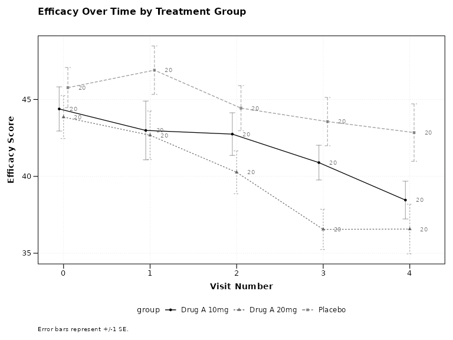

### Observed and Change from Baseline

Clinical trials often require both observed values and change from
baseline:

``` r

# Both observed and change plots
p2 <- lplot(
  clinical_data,
  form = AVAL ~ AVISITN | TRT01P,
  cluster_var = "SUBJID", 
  baseline_value = 0,
  plot_type = "both",
  xlab = "Visit Number",
  ylab = "Efficacy Score",
  ylab2 = "Change from Baseline",
  title = "Observed Efficacy",
  title2 = "Change from Baseline"
)

print(p2)
```

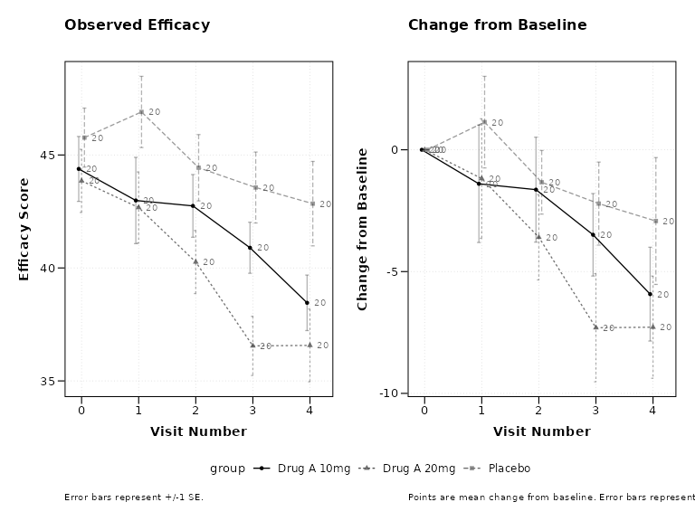

## Clinical Mode Features

### Enable Clinical Mode

The `clinical_mode = TRUE` parameter automatically applies clinical
trial best practices:

``` r

# Clinical mode with all clinical defaults
p3 <- lplot(
  clinical_data,
  form = AVAL ~ AVISITN | TRT01P,
  cluster_var = "SUBJID",
  baseline_value = 0,
  clinical_mode = TRUE,
  plot_type = "both",
  title = "Clinical Trial Results",
  title2 = "Change from Baseline"
)

print(p3)
```

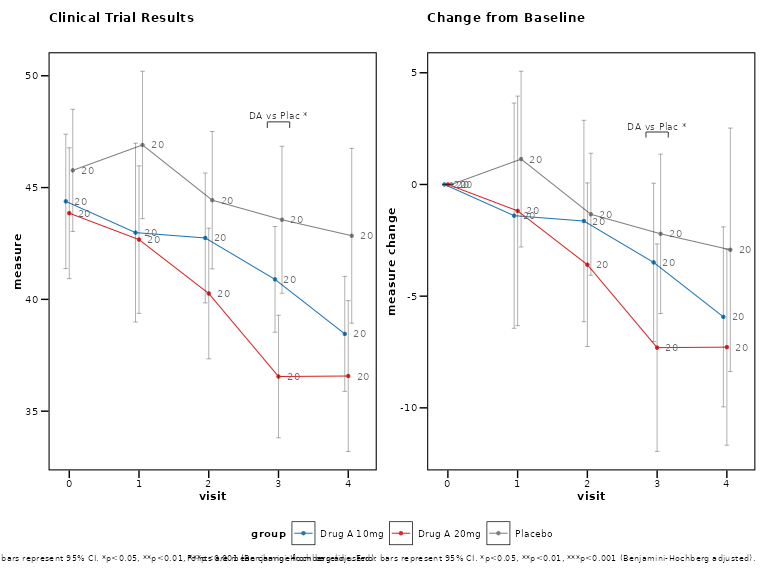

Clinical mode automatically enables: - 95% confidence intervals instead
of standard error - Sample size annotations at each timepoint  
- Clinical color scheme (placebo in gray, treatments in distinct
colors) - Professional theme suitable for regulatory submissions

### Individual Clinical Features

You can also enable clinical features individually:

``` r

# Individual clinical features
p4 <- lplot(
  clinical_data,
  form = AVAL ~ AVISITN | TRT01P,
  cluster_var = "SUBJID",
  baseline_value = 0,
  treatment_colors = "standard",     # Clinical color scheme
  confidence_interval = 0.95,        # 95% CI
  show_sample_sizes = TRUE,          # Show N at each timepoint
  error_type = "bar",               # Error bars (common in clinical)
  title = "Efficacy Analysis - Individual Features"
)

print(p4)
```

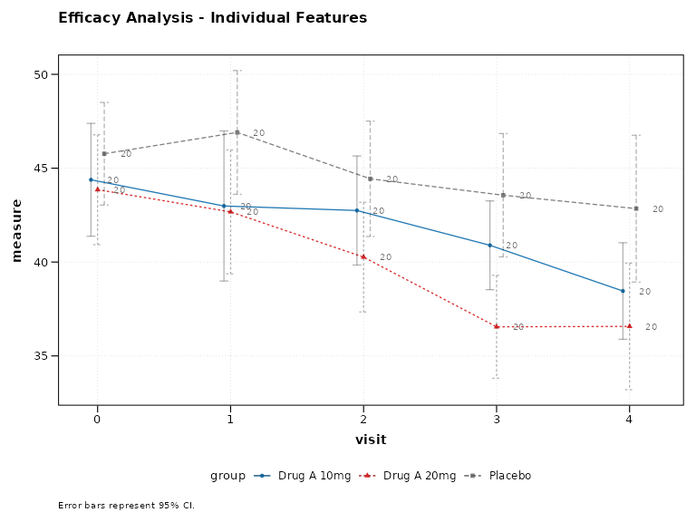

## Advanced Clinical Features

### Categorical Visits

Clinical trials often use visit names instead of numbers:

``` r

# Using categorical visit names
p5 <- lplot(
  clinical_data,
  form = AVAL ~ VISIT | TRT01P,
  cluster_var = "SUBJID",
  baseline_value = "Baseline",
  clinical_mode = TRUE,
  plot_type = "both",
  xlab = "Study Visit",
  title = "Efficacy by Visit",
  title2 = "Change from Baseline"
)

print(p5)
```

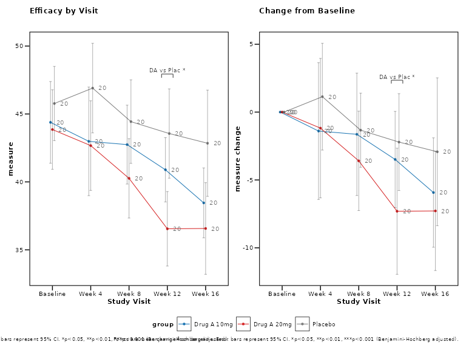

### Visit Timing Variation

Real clinical trials have visit timing variations. `zzlongplot` has no
dedicated visit-window argument; plot against the actual study day by
passing that column as the x variable.

``` r

# Add some visit timing variation
clinical_data_windows <- clinical_data |>
  mutate(
    VISIT_DAY = case_when(
      AVISITN == 0 ~ 0,
      AVISITN == 1 ~ round(rnorm(n(), 28, 3)),    # Target day 28 ± 3
      AVISITN == 2 ~ round(rnorm(n(), 56, 4)),    # Target day 56 ± 4  
      AVISITN == 3 ~ round(rnorm(n(), 84, 5)),    # Target day 84 ± 5
      AVISITN == 4 ~ round(rnorm(n(), 112, 6))    # Target day 112 ± 6
    )
  )

# Plot with visit windows
p6 <- lplot(
  clinical_data_windows,
  form = AVAL ~ VISIT_DAY | TRT01P,
  cluster_var = "SUBJID",
  baseline_value = 0,
  clinical_mode = TRUE,
  xlab = "Study Day",
  title = "Efficacy Over Time (Study Days)"
)
#> Warning: There were 4 warnings in `dplyr::mutate()`.
#> The first warning was:
#> ℹ In argument: `bound_lower = if (...) NULL`.
#> Caused by warning in `stats::qt()`:
#> ! NaNs produced
#> ℹ Run `dplyr::last_dplyr_warnings()` to see the 3 remaining warnings.

print(p6)
```

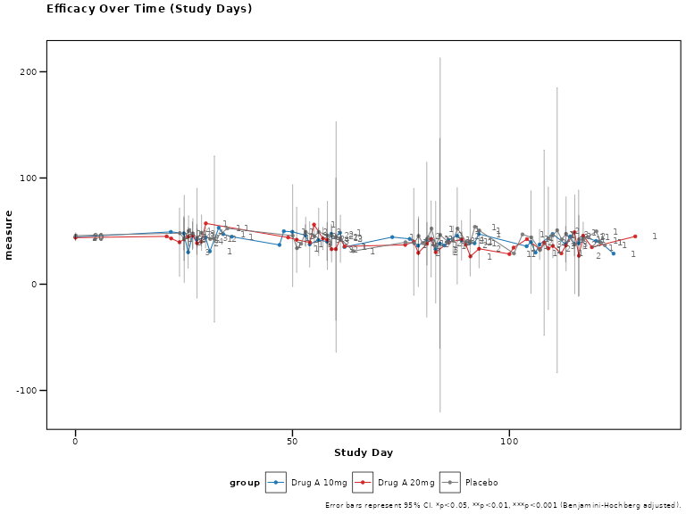

## Regulatory-Ready Outputs

### FDA Theme

Create plots suitable for FDA submissions:

``` r

# FDA regulatory theme
p7 <- lplot(
  clinical_data,
  form = AVAL ~ AVISITN | TRT01P,
  cluster_var = "SUBJID",
  baseline_value = 0,
  theme = "fda",
  plot_type = "both",
  title = "Figure 1.1: Primary Efficacy Endpoint",
  title2 = "Figure 1.2: Change from Baseline",
  caption = "ITT Population, LOCF imputation"
)

print(p7)
```

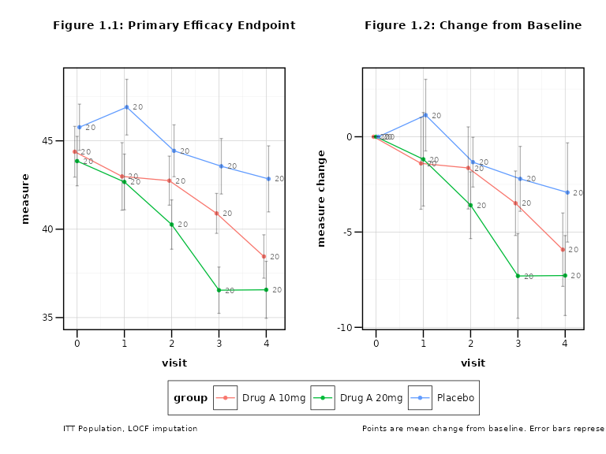

### Export for Regulatory Submission

FDA accepts PDF and TIFF at a minimum of 600 DPI;
[`save_publication()`](https://rgt47.github.io/zzlongplot/reference/save_publication.md)
warns if you ask for anything less, and fills in the journal’s own
defaults when `dpi` and `format` are left unset.

``` r

out_file <- file.path(tempdir(), "Figure_1_1_Primary_Efficacy.pdf")
save_publication(p7,
  filename = out_file,
  journal = "fda",
  width_mm = 254, height_mm = 152
)
#> Plot saved for FDA Regulatory:
#>   File: /tmp/RtmpdKy3MF/Figure_1_1_Primary_Efficacy.pdf
#>   Dimensions: 254 x 152 mm
#>   Resolution: 600 DPI
#>   Format: PDF
```

## Clinical Utility Functions

### CDISC Variable Detection

The package can automatically suggest appropriate formulas for your
clinical data:

``` r

suggestions <- suggest_clinical_vars(clinical_data)
#> CDISC Variable Detection Results:
#> =================================
#> 
#> Suggested Formula: AVAL ~ AVISITN | TRT01P 
#> Cluster Variable: SUBJID 
#> Baseline Value: 0 
#> 
#> Detected Variables:
#>   subject_id: SUBJID
#>   visit: AVISITN, VISITN, VISIT
#>   analysis_value: AVAL
#>   treatment: TRT01P
#> 
#> Warnings:
#>   ! Using non-standard subject ID 'SUBJID'. Consider USUBJID.
#>   ! No population analysis flags detected. Consider adding SAFFL, FASFL.
print(suggestions)
#> $suggested_formula
#> [1] "AVAL ~ AVISITN | TRT01P"
#> 
#> $detected_vars
#> $detected_vars$subject_id
#> secondary 
#>  "SUBJID" 
#> 
#> $detected_vars$visit
#>  numeric1  numeric2 character 
#> "AVISITN"  "VISITN"   "VISIT" 
#> 
#> $detected_vars$analysis_value
#> primary 
#>  "AVAL" 
#> 
#> $detected_vars$treatment
#>  planned 
#> "TRT01P" 
#> 
#> $detected_vars$change
#> character(0)
#> 
#> $detected_vars$population
#> character(0)
#> 
#> 
#> $cluster_var
#> [1] "SUBJID"
#> 
#> $baseline_value
#> [1] 0
#> 
#> $warnings
#> [1] "Using non-standard subject ID 'SUBJID'. Consider USUBJID."           
#> [2] "No population analysis flags detected. Consider adding SAFFL, FASFL."
```

### Clinical Color Palettes

Get standard clinical color palettes:

``` r

# Get clinical color palette: placebo grey, then active treatments
colors <- clinical_colors(type = "treatment", n = 3)
print(colors)
#> [1] "#7F7F7F" "#1F77B4" "#D62728"

# Use with custom styling
p8 <- lplot(
  clinical_data,
  form = AVAL ~ AVISITN | TRT01P,
  cluster_var = "SUBJID",
  baseline_value = 0,
  color_palette = colors
)
```

## Best Practices for Clinical Trials

### 1. Always Show Both Observed and Change

Most clinical protocols require both perspectives:

``` r

# Best practice: Show both plots
lplot(clinical_data, AVAL ~ AVISITN | TRT01P, 
      cluster_var = "SUBJID", baseline_value = 0,
      plot_type = "both", clinical_mode = TRUE)
```

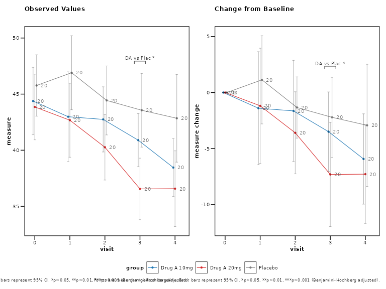

### 2. Use Confidence Intervals

95% confidence intervals are standard in clinical trials:

``` r

# Best practice: 95% confidence intervals
lplot(clinical_data, AVAL ~ AVISITN | TRT01P,
      cluster_var = "SUBJID", baseline_value = 0, 
      confidence_interval = 0.95)
```

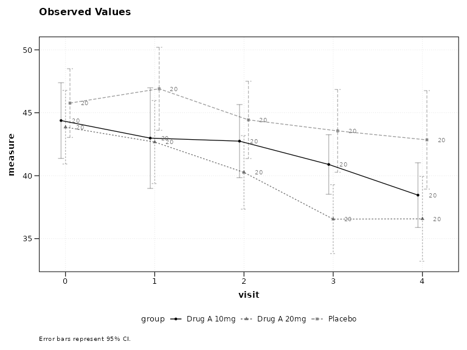

### 3. Include Sample Sizes

Show sample sizes to indicate data completeness:

``` r

# Best practice: Show sample sizes
lplot(clinical_data, AVAL ~ AVISITN | TRT01P,
      cluster_var = "SUBJID", baseline_value = 0,
      show_sample_sizes = TRUE, clinical_mode = TRUE)
```

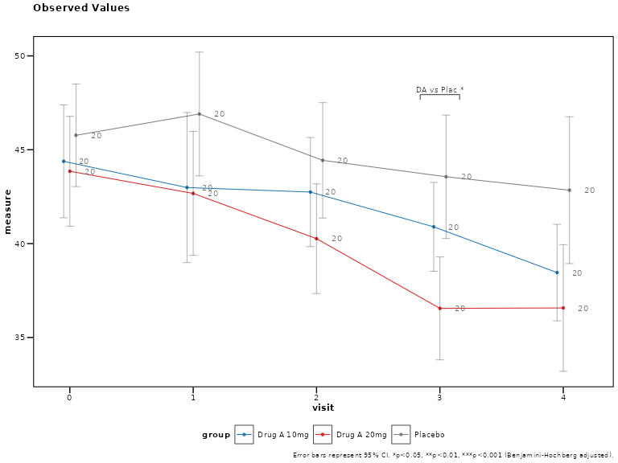

### 4. Use Professional Themes

Regulatory submissions require clean, professional appearance:

``` r

# Best practice: Professional themes
lplot(clinical_data, AVAL ~ AVISITN | TRT01P,
      cluster_var = "SUBJID", baseline_value = 0,
      theme = "fda", clinical_mode = TRUE)
```

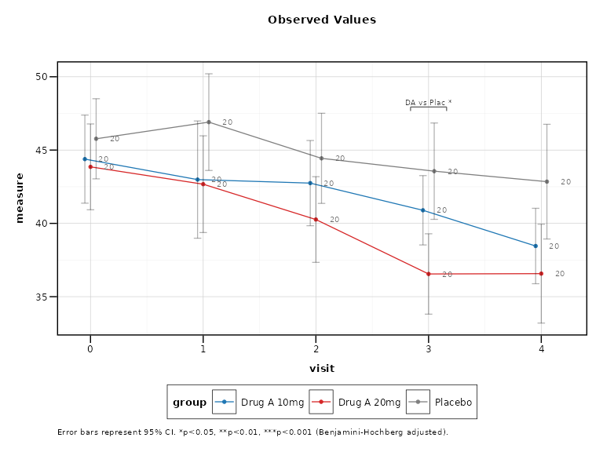

## Conclusion

The `zzlongplot` package provides comprehensive support for clinical
trial data visualization, from basic efficacy plots to regulatory-ready
submissions. The clinical mode feature enables best practices with a
single parameter, while individual features allow for custom
requirements.

Key clinical features include: - CDISC variable recognition - Clinical
color schemes and themes  
- Confidence intervals and sample size annotations - Visit window
handling - Regulatory output formats - Professional themes for
submissions

For more examples and advanced features, see the CDISC Compliance
vignette.
