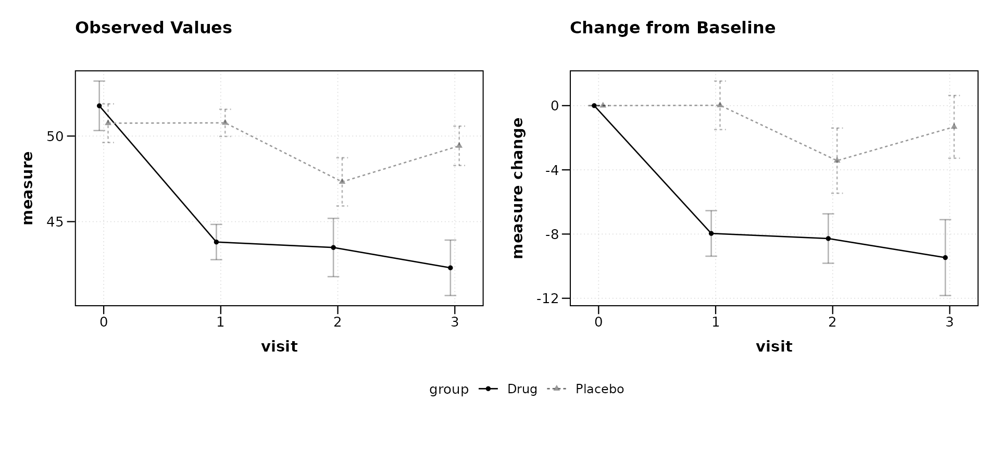
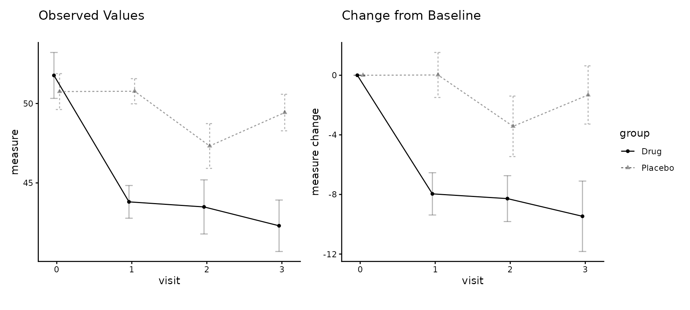
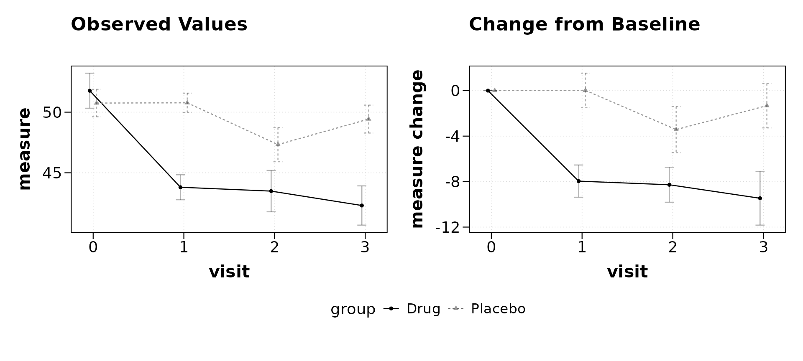
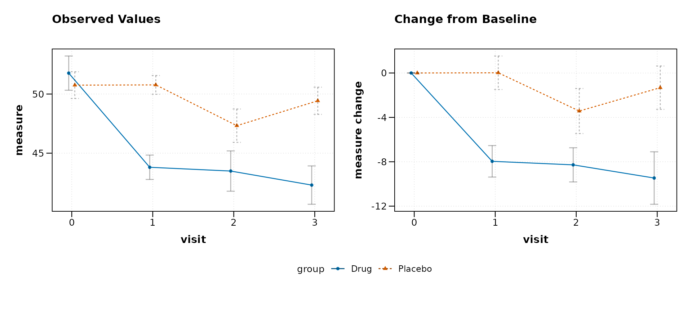
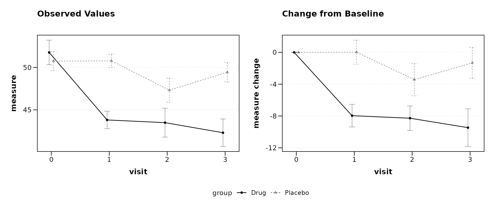
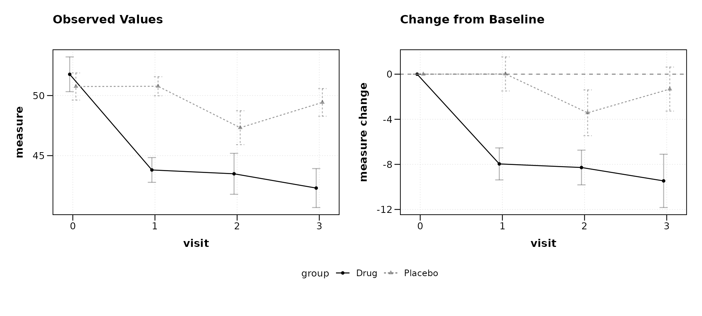
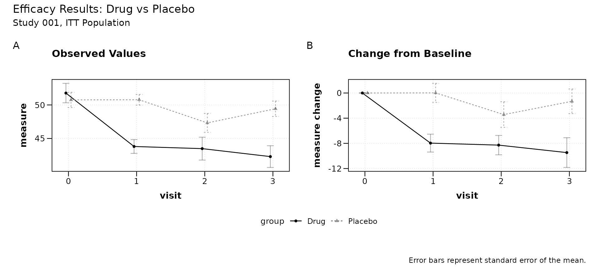
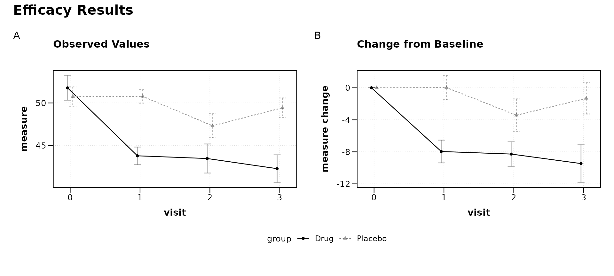
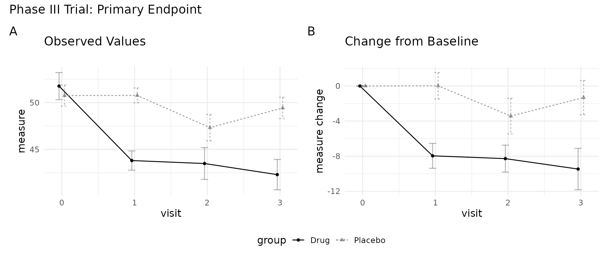
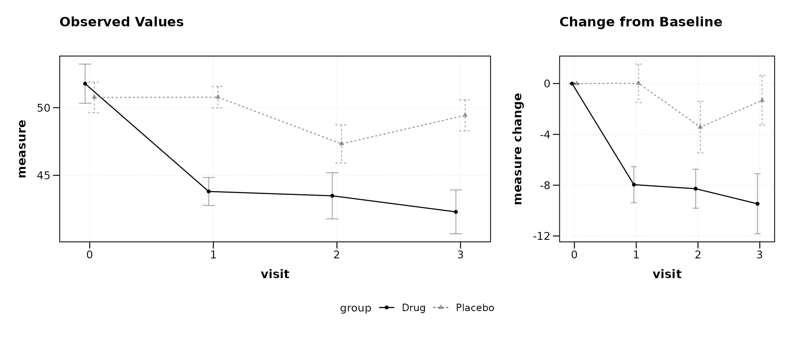

# Customizing Combined Plots

``` r

library(zzlongplot)
library(ggplot2)
library(patchwork)
```

## Overview

When [`lplot()`](https://rgt47.github.io/zzlongplot/reference/lplot.md)
is called with `plot_type = "both"`, it returns a patchwork object that
places the observed values and change-from-baseline plots side by side.
This object can be modified after creation using two patchwork
operators:

- `&` applies a modification to **all** panels
- `+` applies a modification to the **last** panel only

This vignette demonstrates common post-creation customizations.

## Example data

``` r

set.seed(42)
n <- 20

trial <- data.frame(
  subject_id = rep(1:n, each = 4),
  visit = rep(0:3, times = n),
  arm = rep(c("Drug", "Placebo"), each = 4 * n / 2)
)
trial$score <- 50 +
  ifelse(trial$arm == "Drug", -3, -0.5) * trial$visit +
  rnorm(nrow(trial), sd = 4)
```

## Base combined plot

``` r

p <- lplot(trial, score ~ visit | arm, baseline_value = 0,
           plot_type = "both")
#> Warning: The `size` argument of `element_line()` is deprecated as of ggplot2 3.4.0.
#> ℹ Please use the `linewidth` argument instead.
#> ℹ The deprecated feature was likely used in the zzlongplot package.
#>   Please report the issue at <https://github.com/rgt47/zzlongplot/issues>.
#> This warning is displayed once per session.
#> Call `lifecycle::last_lifecycle_warnings()` to see where this warning was
#> generated.
#> Warning: The `size` argument of `element_rect()` is deprecated as of ggplot2 3.4.0.
#> ℹ Please use the `linewidth` argument instead.
#> ℹ The deprecated feature was likely used in the zzlongplot package.
#>   Please report the issue at <https://github.com/rgt47/zzlongplot/issues>.
#> This warning is displayed once per session.
#> Call `lifecycle::last_lifecycle_warnings()` to see where this warning was
#> generated.
p
```



## Modifying all panels with `&`

The `&` operator passes a ggplot2 element to every panel in the
composition. This is useful for global theme changes, font adjustments,
or color overrides.

### Change the theme

``` r

p & theme_classic()
```



### Adjust font size

``` r

p & theme(text = element_text(size = 14))
```



### Override group colors

``` r

p & scale_color_manual(values = c("Drug" = "#0072B2",
                                  "Placebo" = "#D55E00"))
#> Scale for colour is already present.
#> Adding another scale for colour, which will replace the existing scale.
#> Scale for colour is already present.
#> Adding another scale for colour, which will replace the existing scale.
```



### Remove gridlines

``` r

p & theme(panel.grid.minor = element_blank(),
          panel.grid.major.x = element_blank())
```



## Modifying a single panel with `+`

The `+` operator targets only the last panel (the change plot in a
`"both"` layout). This allows selective modifications when the two
panels need different treatment.

### Add a reference line to the change plot

``` r

p + geom_hline(yintercept = 0, linetype = "dashed",
               color = "grey50")
```



## Adding overall annotations

The
[`plot_annotation()`](https://patchwork.data-imaginist.com/reference/plot_annotation.html)
function from patchwork adds titles, subtitles, captions, and tag labels
that span the entire composition, sitting above or below the individual
panel labels.

``` r

p + plot_annotation(
  title = "Efficacy Results: Drug vs Placebo",
  subtitle = "Study 001, ITT Population",
  caption = "Error bars represent standard error of the mean.",
  tag_levels = "A"
)
```



Panel tags (`tag_levels = "A"`) label each panel as (A), (B), etc.,
which is a common requirement for journal submissions.

### Styling the annotation

Annotation text inherits from the plot theme but can be overridden:

``` r

p + plot_annotation(
  title = "Efficacy Results",
  tag_levels = "A",
  theme = theme(
    plot.title = element_text(face = "bold", size = 16),
    plot.tag = element_text(face = "bold")
  )
)
```



## Combining multiple modifications

The operators can be chained. Use `&` for global changes first, then `+`
for composition-level annotations.

``` r

(p &
  theme_minimal() &
  theme(legend.position = "bottom",
        text = element_text(size = 12))) +
  plot_annotation(
    title = "Phase III Trial: Primary Endpoint",
    tag_levels = "A"
  )
```



## Controlling layout

The layout itself can be adjusted after creation using
[`plot_layout()`](https://patchwork.data-imaginist.com/reference/plot_layout.html):

``` r

p + plot_layout(widths = c(2, 1))
```



This produces a wider observed panel and a narrower change panel, which
can be useful when the change plot carries less visual complexity.

## Summary

| Operator              | Scope                      | Example                 |
|:----------------------|:---------------------------|:------------------------|
| `&`                   | All panels                 | `p & theme_bw()`        |
| `+`                   | Last panel (or annotation) | `p + geom_hline(...)`   |
| `+ plot_annotation()` | Entire composition         | titles, tags, captions  |
| `+ plot_layout()`     | Entire composition         | widths, heights, guides |

Because
[`lplot()`](https://rgt47.github.io/zzlongplot/reference/lplot.md)
returns a standard patchwork object, any technique documented in the
[patchwork package](https://patchwork.data-imaginist.com/) applies
directly.
