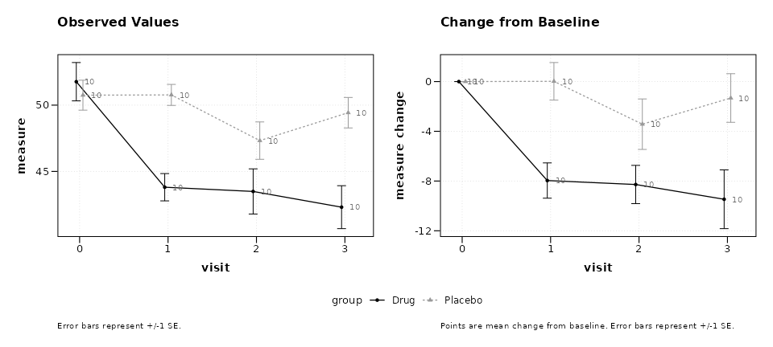
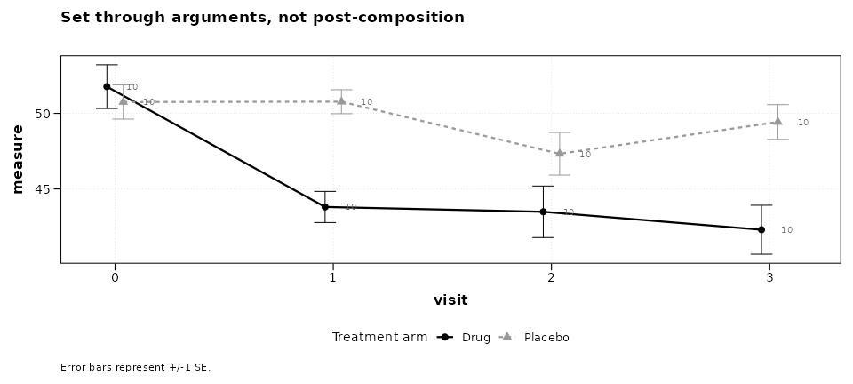
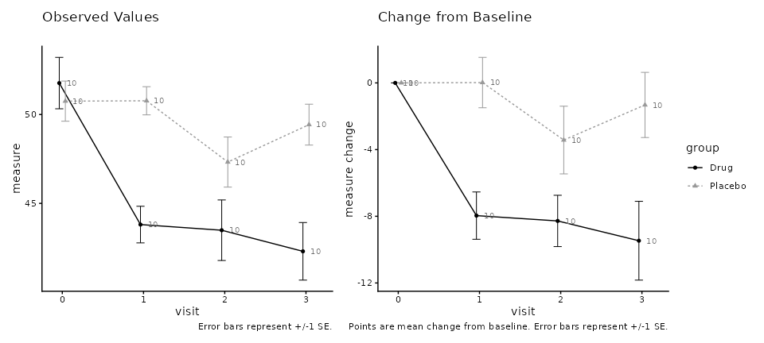
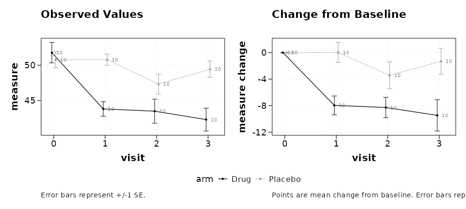
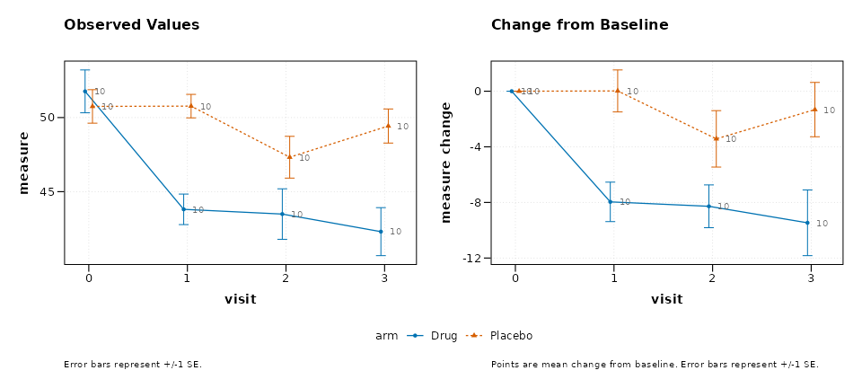
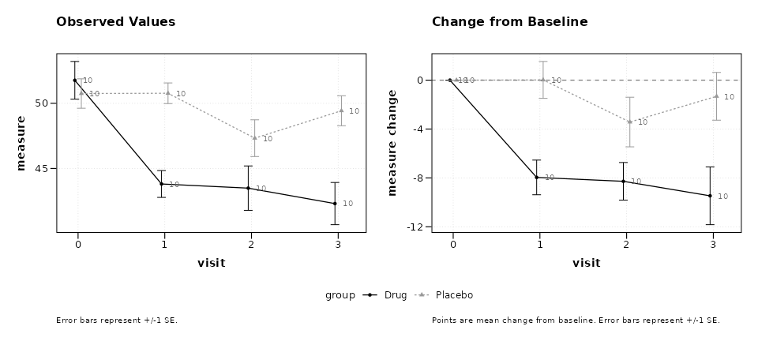
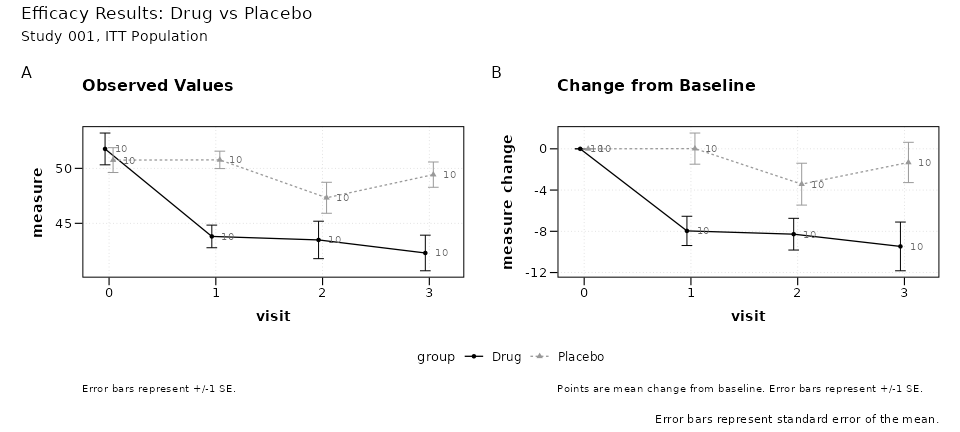
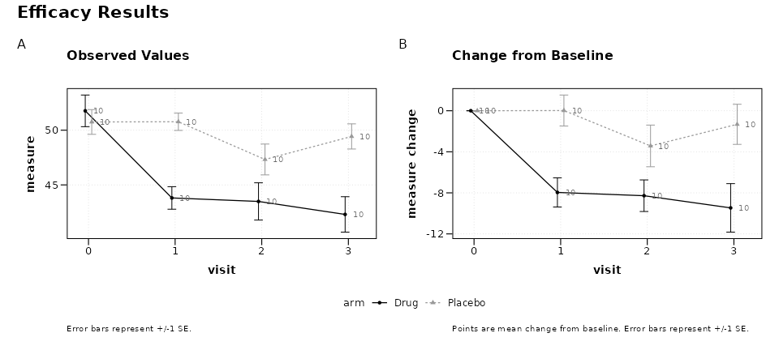
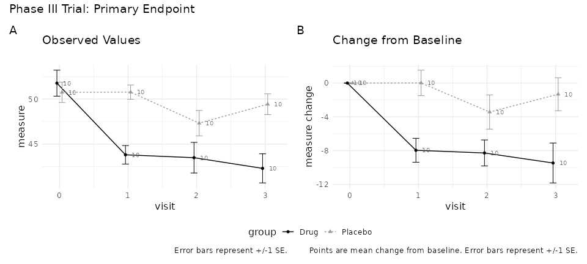
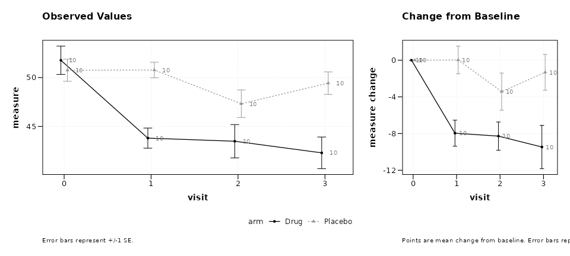

# Customizing Combined Plots

``` r

library(zzlongplot)
library(ggplot2)
library(patchwork)
```

## Overview

When [`lplot()`](https://rgt47.github.io/zzlongplot/reference/lplot.md)
is called with `plot_type = "both"`, it returns a patchwork object that
places the observed values and change-from-baseline plots side by side.
This object can be modified after creation using two patchwork
operators:

- `&` applies a modification to **all** panels
- `+` applies a modification to the **last** panel only

This vignette demonstrates common post-creation customizations.

## Example data

``` r

set.seed(42)
n <- 20

trial <- data.frame(
  subject_id = rep(1:n, each = 4),
  visit = rep(0:3, times = n),
  arm = rep(c("Drug", "Placebo"), each = 4 * n / 2)
)
trial$score <- 50 +
  ifelse(trial$arm == "Drug", -3, -0.5) * trial$visit +
  rnorm(nrow(trial), sd = 4)
```

## Base combined plot

``` r

p <- lplot(trial, score ~ visit | arm, baseline_value = 0,
           plot_type = "both")
p
```



## Prefer an argument where one exists

Post-composition is the right tool for anything patchwork-specific, and
for one-off adjustments. It is the wrong tool for settings
[`lplot()`](https://rgt47.github.io/zzlongplot/reference/lplot.md)
already accepts, for two reasons: an added scale replaces whatever scale
the plot already carried, and an added **complete** theme
([`theme_bw()`](https://ggplot2.tidyverse.org/reference/ggtheme.html),
[`theme_minimal()`](https://ggplot2.tidyverse.org/reference/ggtheme.html),
a journal theme) resets every theme setting
[`lplot()`](https://rgt47.github.io/zzlongplot/reference/lplot.md) made,
including the plot margin and legend position that the sample-size table
depends on. A partial `theme(...)` call, which changes only the elements
it names, is safe.

Several arguments exist precisely so that common customizations do not
have to go through `+`:

| Instead of appending | Pass |
|:---|:---|
| `scale_x_continuous(breaks = ...)` | `x_breaks` |
| `labs(colour = ..., fill = ..., linetype = ..., shape = ...)` | `legend_title` |
| `theme_bw(base_size = 9)` | `base_size` |
| `facet_wrap(..., labeller = ...)` | `facet_type`, `facet_labeller` |
| `geom_point(size = ...)`, `geom_line(linewidth = ...)` | `point_size`, `line_width` |

`legend_title` is worth singling out. The grouping column is renamed
internally, so retitling the legend by hand means naming all four
aesthetics: under `bw_print` the linetype and shape are mapped to the
group as well as the colour, and retitling only the colour splits one
key into two.

``` r

lplot(trial, score ~ visit | arm, baseline_value = 0,
      plot_type = "obs",
      x_breaks = 0:3,
      legend_title = "Treatment arm",
      point_size = 2.5,
      line_width = 0.8,
      base_size = 11,
      title = "Set through arguments, not post-composition")
```



## Modifying all panels with `&`

The `&` operator passes a ggplot2 element to every panel in the
composition. This is useful for global theme changes, font adjustments,
or color overrides.

### Change the theme

``` r

p & theme_classic()
```



### Adjust font size

``` r

p & theme(text = element_text(size = 14))
```



### Override group colors

``` r

p & scale_color_manual(values = c("Drug" = "#0072B2",
                                  "Placebo" = "#D55E00"))
#> Scale for colour is already present.
#> Adding another scale for colour, which will replace the existing scale.
#> Scale for colour is already present.
#> Adding another scale for colour, which will replace the existing scale.
```



### Remove gridlines

``` r

p & theme(panel.grid.minor = element_blank(),
          panel.grid.major.x = element_blank())
```


## Modifying a single panel with `+`

The `+` operator targets only the last panel (the change plot in a
`"both"` layout). This allows selective modifications when the two
panels need different treatment.

### Add a reference line to the change plot

``` r

p + geom_hline(yintercept = 0, linetype = "dashed",
               color = "grey50")
```



## Adding overall annotations

The
[`plot_annotation()`](https://patchwork.data-imaginist.com/reference/plot_annotation.html)
function from patchwork adds titles, subtitles, captions, and tag labels
that span the entire composition, sitting above or below the individual
panel labels.

``` r

p + plot_annotation(
  title = "Efficacy Results: Drug vs Placebo",
  subtitle = "Study 001, ITT Population",
  caption = "Error bars represent standard error of the mean.",
  tag_levels = "A"
)
```



Panel tags (`tag_levels = "A"`) label each panel as (A), (B), etc.,
which is a common requirement for journal submissions.

### Styling the annotation

Annotation text inherits from the plot theme but can be overridden:

``` r

p + plot_annotation(
  title = "Efficacy Results",
  tag_levels = "A",
  theme = theme(
    plot.title = element_text(face = "bold", size = 16),
    plot.tag = element_text(face = "bold")
  )
)
```



## Combining multiple modifications

The operators can be chained. Use `&` for global changes first, then `+`
for composition-level annotations.

``` r

(p &
  theme_minimal() &
  theme(legend.position = "bottom",
        text = element_text(size = 12))) +
  plot_annotation(
    title = "Phase III Trial: Primary Endpoint",
    tag_levels = "A"
  )
```



## Controlling layout

The layout itself can be adjusted after creation using
[`plot_layout()`](https://patchwork.data-imaginist.com/reference/plot_layout.html):

``` r

p + plot_layout(widths = c(2, 1))
```



This produces a wider observed panel and a narrower change panel, which
can be useful when the change plot carries less visual complexity.

## Summary

| Operator              | Scope                      | Example                 |
|:----------------------|:---------------------------|:------------------------|
| `&`                   | All panels                 | `p & theme_bw()`        |
| `+`                   | Last panel (or annotation) | `p + geom_hline(...)`   |
| `+ plot_annotation()` | Entire composition         | titles, tags, captions  |
| `+ plot_layout()`     | Entire composition         | widths, heights, guides |

Because
[`lplot()`](https://rgt47.github.io/zzlongplot/reference/lplot.md)
returns a standard patchwork object, any technique documented in the
[patchwork package](https://patchwork.data-imaginist.com/) applies
directly.

One caution when combining the two approaches: `&` with a complete theme
replaces the theme
[`lplot()`](https://rgt47.github.io/zzlongplot/reference/lplot.md)
applied, so a figure using `sample_size_opts = list(position = "table")`
loses the margin reserved for its count rows. Either set the type size
with `base_size` rather than re-theming, or use `region = "panel"`,
which places the rows inside the panel and needs no reserved margin.
