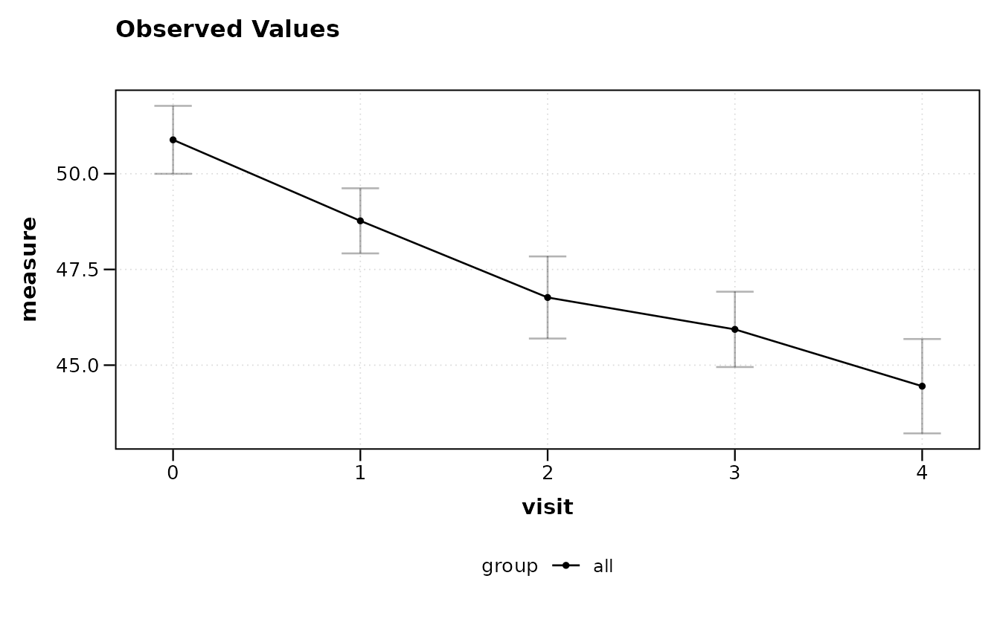
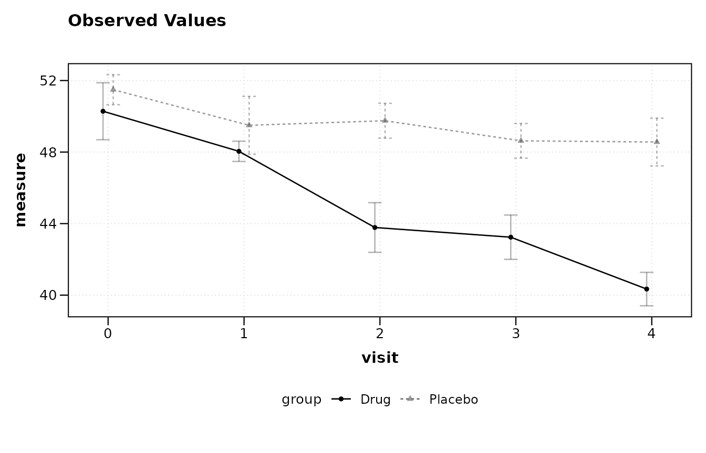
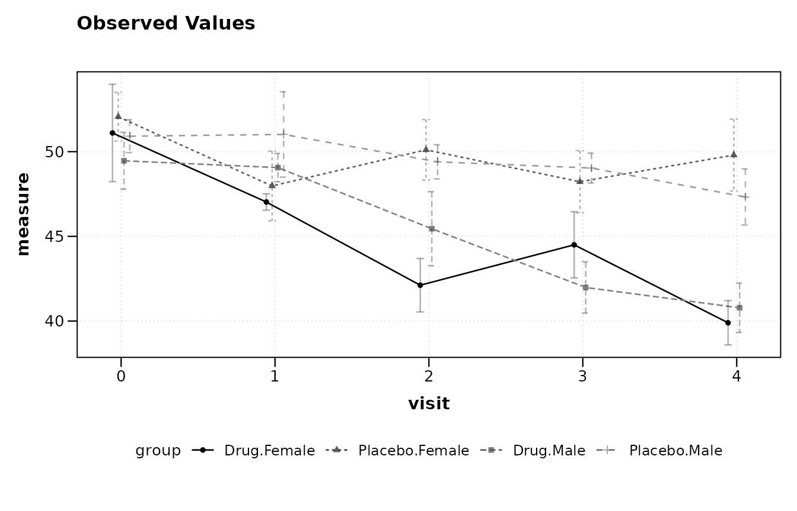
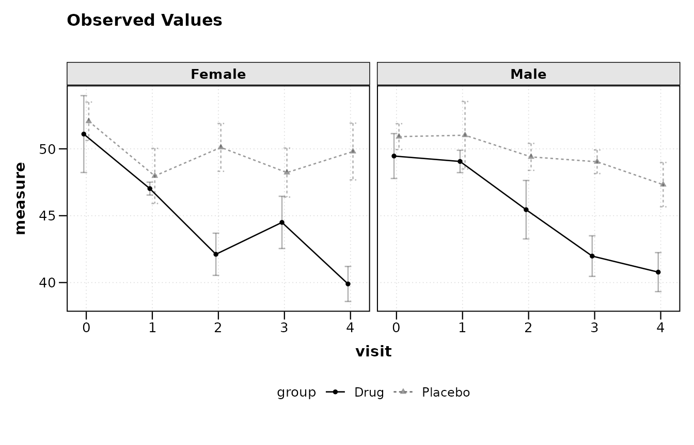
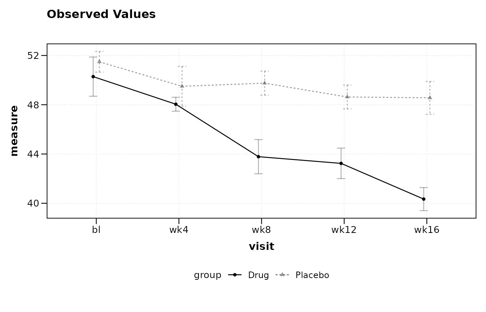
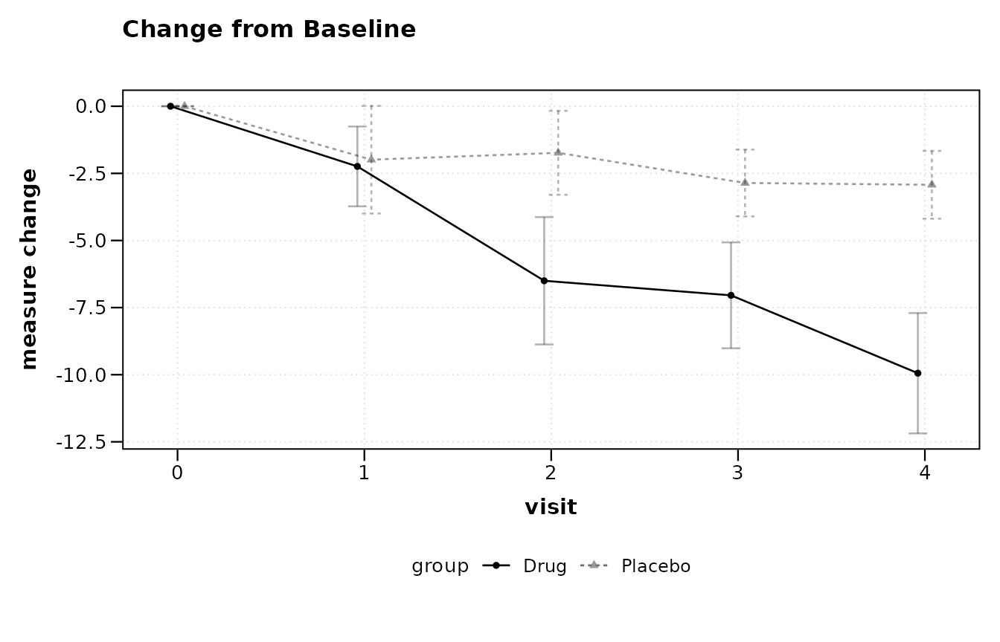
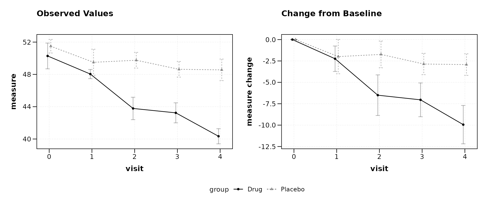

# The Formula Interface

``` r

library(zzlongplot)
library(ggplot2)
```

## Overview

The [`lplot()`](https://rgt47.github.io/zzlongplot/reference/lplot.md)
function uses a formula interface to specify the relationship between
outcome, time, and grouping variables. This design follows the
convention established by base R modeling functions such as
[`lm()`](https://rdrr.io/r/stats/lm.html) and
[`aov()`](https://rdrr.io/r/stats/aov.html), making the syntax familiar
to most R users.

The general form is:

    outcome ~ time | group

where each component maps to a plot element:

- **outcome** (left of `~`): the response variable, plotted on the
  y-axis
- **time** (right of `~`, before `|`): the independent variable, plotted
  on the x-axis
- **group** (after `|`): an optional grouping variable, mapped to color
  and linetype

The formula is parsed internally by
[`parse_formula()`](https://rgt47.github.io/zzlongplot/reference/parse_formula.md),
which extracts each component as a character string for downstream use
in summary statistics and plot construction.

## Example data

The examples below use a simulated longitudinal dataset with two
treatment arms measured at five visits.

``` r

set.seed(123)
n <- 20

trial <- data.frame(
  subject_id = rep(1:n, each = 5),
  visit = rep(0:4, times = n),
  arm = rep(c("Drug", "Placebo"), each = 5 * n / 2)
)
trial$score <- 50 +
  ifelse(trial$arm == "Drug", -2.5, -0.5) * trial$visit +
  rnorm(nrow(trial), sd = 4)
```

## Simple formula: `y ~ x`

The minimal formula specifies only an outcome and a time variable. This
produces a single line with error bars summarising all subjects
together, with no group differentiation.

``` r

lplot(trial, score ~ visit, baseline_value = 0,
      plot_type = "obs")
#> Warning: The `size` argument of `element_line()` is deprecated as of ggplot2 3.4.0.
#> ℹ Please use the `linewidth` argument instead.
#> ℹ The deprecated feature was likely used in the zzlongplot package.
#>   Please report the issue at <https://github.com/rgt47/zzlongplot/issues>.
#> This warning is displayed once per session.
#> Call `lifecycle::last_lifecycle_warnings()` to see where this warning was
#> generated.
#> Warning: The `size` argument of `element_rect()` is deprecated as of ggplot2 3.4.0.
#> ℹ Please use the `linewidth` argument instead.
#> ℹ The deprecated feature was likely used in the zzlongplot package.
#>   Please report the issue at <https://github.com/rgt47/zzlongplot/issues>.
#> This warning is displayed once per session.
#> Call `lifecycle::last_lifecycle_warnings()` to see where this warning was
#> generated.
```



## Adding a group: `y ~ x | group`

The pipe operator `|` introduces a grouping variable. Each level of the
group receives its own line and color.

``` r

lplot(trial, score ~ visit | arm, baseline_value = 0,
      plot_type = "obs")
```



## Multiple grouping variables: `y ~ x | g1 + g2`

When the data contain more than one factor of interest, combine them
with `+`. The groups are concatenated into a single interaction factor
for plotting.

``` r

trial$sex <- rep(c("Male", "Female"), length.out = nrow(trial))

lplot(trial, score ~ visit | arm + sex, baseline_value = 0,
      plot_type = "obs")
```



## Adding facets: `y ~ x | group` with `facet_form`

Faceting is specified through a separate `facet_form` argument rather
than through the main formula. This keeps the primary formula concise
while still supporting panel layouts.

``` r

lplot(trial, score ~ visit | arm, baseline_value = 0,
      facet_form = ~ sex,
      plot_type = "obs")
```



For two-dimensional faceting, use a two-sided formula:

``` r

lplot(trial, score ~ visit | arm, baseline_value = 0,
      facet_form = sex ~ site,
      plot_type = "obs")
```

## Baseline auto-detection

When `baseline_value` is omitted (or set to `NULL`),
[`lplot()`](https://rgt47.github.io/zzlongplot/reference/lplot.md)
attempts to identify the baseline visit automatically. For numeric visit
variables, the minimum value is used. For character or factor visit
codes, the function searches for common labels including `'bl'`, `'BL'`,
`'baseline'`, `'screening'`, `'scr'`, `'day 0'`, `'week 0'`, `'pre'`,
and `'visit 1'`.

A message is printed to the console reporting which value was selected.

``` r

lplot(trial, score ~ visit | arm, plot_type = "obs")
#> baseline_value not specified; using 0 (minimum numeric value).
```


If the visit variable uses a recognised character code, the detection
works the same way:

``` r

trial_char <- trial
trial_char$visit <- factor(
  trial_char$visit,
  levels = 0:4,
  labels = c("bl", "wk4", "wk8", "wk12", "wk16")
)

lplot(trial_char, score ~ visit | arm, plot_type = "obs")
#> baseline_value not specified; using 'bl'.
```



If no common baseline label is found, or if multiple candidates match
(e.g., a dataset containing both `'bl'` and `'baseline'`), the function
raises an informative error asking the user to set `baseline_value`
explicitly.

## Change from baseline

The `plot_type` argument controls whether observed values, change
scores, or both are displayed. The formula itself does not change; the
same specification drives all three plot types.

``` r

lplot(trial, score ~ visit | arm, baseline_value = 0,
      plot_type = "change")
```



``` r

lplot(trial, score ~ visit | arm, baseline_value = 0,
      plot_type = "both")
```



## Formula parsing details

The
[`parse_formula()`](https://rgt47.github.io/zzlongplot/reference/parse_formula.md)
function is exported and can be called directly to inspect how a formula
is decomposed:

``` r

parse_formula(score ~ visit | arm)
#> $y
#> [1] "score"
#> 
#> $x
#> [1] "visit"
#> 
#> $group
#> [1] "arm"
#> 
#> $facets
#> NULL
```

For formulas with faceting specified in the main formula (an alternative
syntax), a second `~` introduces facet variables:

``` r

parse_formula(score ~ visit | arm ~ site)
#> $y
#> [1] "score"
#> 
#> $x
#> [1] "visit"
#> 
#> $group
#> [1] "arm"
#> 
#> $facets
#> [1] "site"
parse_formula(score ~ visit | arm ~ site + region)
#> $y
#> [1] "score"
#> 
#> $x
#> [1] "visit"
#> 
#> $group
#> [1] "arm"
#> 
#> $facets
#> [1] "site"   "region"
```

## Summary

The table below lists the supported formula patterns and their
corresponding plot mappings.

| Formula                | y-axis | x-axis | Color/group | Facet  |
|:-----------------------|:-------|:-------|:------------|:-------|
| `y ~ x`                | y      | x      | none        | none   |
| `y ~ x \| g`           | y      | x      | g           | none   |
| `y ~ x \| g1 + g2`     | y      | x      | g1:g2       | none   |
| `y ~ x \| g ~ f`       | y      | x      | g           | f      |
| `y ~ x \| g ~ f1 + f2` | y      | x      | g           | f1, f2 |

The `facet_form` argument provides an equivalent and often clearer way
to specify facets separately from the main formula:

| Main formula | facet_form | Result                          |
|:-------------|:-----------|:--------------------------------|
| `y ~ x \| g` | `~ f`      | columns by f                    |
| `y ~ x \| g` | `f1 ~ f2`  | grid: rows by f1, columns by f2 |
