# Publication-Ready Themes and Journal Color Palettes

``` r

library(zzlongplot)
library(ggplot2)
library(patchwork)
```

## Overview

The `zzlongplot` package provides publication-ready themes and color
palettes specifically designed for major medical journals. This vignette
demonstrates the various themes available and shows how they can be used
to create professional, journal-ready figures.

### Key Features

- **Complete journal styling** with a single `theme` parameter
- **Official color palettes** from major medical journals (via ggsci
  package)
- **Accessibility compliance** with colorblind-friendly options
- **Professional typography** following journal guidelines
- **Automatic color application** with manual override capability

## Sample Data

Let’s create a realistic clinical trial dataset to demonstrate the
themes:

``` r

# Create comprehensive clinical trial dataset
set.seed(123)
n_subjects <- 90
n_visits <- 4

demo_data <- data.frame(
  subject_id = rep(1:n_subjects, each = n_visits),
  visit = rep(c(0, 4, 8, 12), times = n_subjects),
  treatment = rep(c("Placebo", "Drug 10mg", "Drug 20mg"), each = n_visits * 30)
)

# Generate realistic clinical outcomes
for (subj in unique(demo_data$subject_id)) {
  subj_rows <- which(demo_data$subject_id == subj)
  treatment <- demo_data$treatment[subj_rows[1]]
  
  # Baseline efficacy score
  baseline <- 50 + rnorm(1, 0, 10)
  
  # Treatment-specific efficacy improvements
  if (treatment == "Placebo") {
    effects <- c(0, 2, 3, 4)  # Small placebo effect
  } else if (treatment == "Drug 10mg") {
    effects <- c(0, 8, 14, 18)  # Moderate dose effect
  } else {  # Drug 20mg
    effects <- c(0, 12, 22, 28)  # High dose effect
  }
  
  # Generate data with realistic variability
  demo_data$efficacy[subj_rows] <- baseline + effects + rnorm(4, 0, 8)
}

# Display data structure
str(demo_data)
#> 'data.frame':    360 obs. of  4 variables:
#>  $ subject_id: int  1 1 1 1 2 2 2 2 3 3 ...
#>  $ visit     : num  0 4 8 12 0 4 8 12 0 4 ...
#>  $ treatment : chr  "Placebo" "Placebo" "Placebo" "Placebo" ...
#>  $ efficacy  : num  42.6 58.9 48 49.4 70.8 ...
head(demo_data, 12)
#>    subject_id visit treatment efficacy
#> 1           1     0   Placebo 42.55382
#> 2           1     4   Placebo 58.86491
#> 3           1     8   Placebo 47.95931
#> 4           1    12   Placebo 49.42955
#> 5           2     0   Placebo 70.83798
#> 6           2     4   Placebo 59.03016
#> 7           2     8   Placebo 64.65583
#> 8           2    12   Placebo 67.58535
#> 9           3     0   Placebo 65.11933
#> 10          3     4   Placebo 67.44699
#> 11          3     8   Placebo 66.12628
#> 12          3    12   Placebo 61.79409
```

## Major Medical Journal Themes

### New England Journal of Medicine (NEJM)

The NEJM theme provides professional, clinical styling with the
journal’s official color palette.

``` r

p_nejm <- lplot(demo_data, 
               efficacy ~ visit | treatment,
               cluster_var = "subject_id",
               baseline_value = 0,
               theme = "nejm",
               title = "Clinical Efficacy Over Time",
               subtitle = "NEJM Theme with Official Colors",
               xlab = "Week",
               ylab = "Efficacy Score (points)")
#> Warning: The `size` argument of `element_line()` is deprecated as of ggplot2 3.4.0.
#> ℹ Please use the `linewidth` argument instead.
#> ℹ The deprecated feature was likely used in the zzlongplot package.
#>   Please report the issue at <https://github.com/rgt47/zzlongplot/issues>.
#> This warning is displayed once per session.
#> Call `lifecycle::last_lifecycle_warnings()` to see where this warning was
#> generated.
#> Warning: The `size` argument of `element_rect()` is deprecated as of ggplot2 3.4.0.
#> ℹ Please use the `linewidth` argument instead.
#> ℹ The deprecated feature was likely used in the zzlongplot package.
#>   Please report the issue at <https://github.com/rgt47/zzlongplot/issues>.
#> This warning is displayed once per session.
#> Call `lifecycle::last_lifecycle_warnings()` to see where this warning was
#> generated.

p_nejm
```

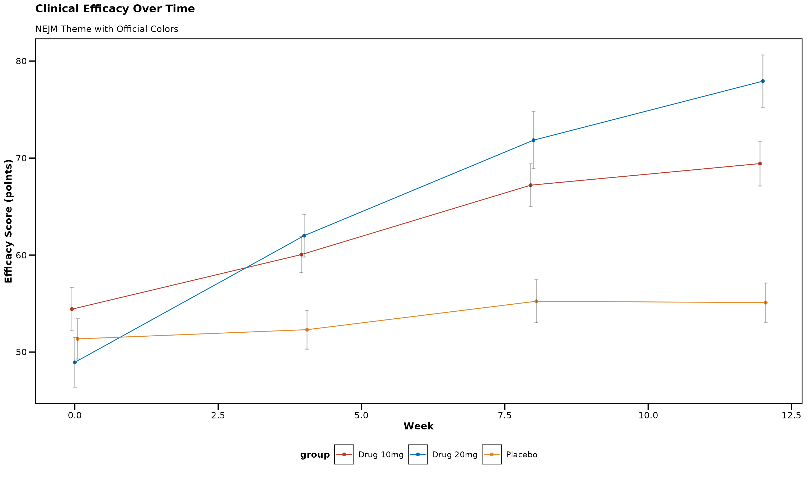

**NEJM Theme Features:** - Professional clinical appearance - Bold axis
titles for clarity - Clean, no-grid design - Official NEJM color
palette: Red (#BC3C29), Blue (#0072B5), Orange (#E18727)

### Nature Publishing Group

The Nature theme follows Nature journal guidelines with modern,
sophisticated styling.

``` r

p_nature <- lplot(demo_data,
                 efficacy ~ visit | treatment,
                 cluster_var = "subject_id", 
                 baseline_value = 0,
                 theme = "nature",
                 title = "Clinical Efficacy Over Time",
                 subtitle = "Nature Theme with Official Colors",
                 xlab = "Week",
                 ylab = "Efficacy Score (points)")

p_nature
```

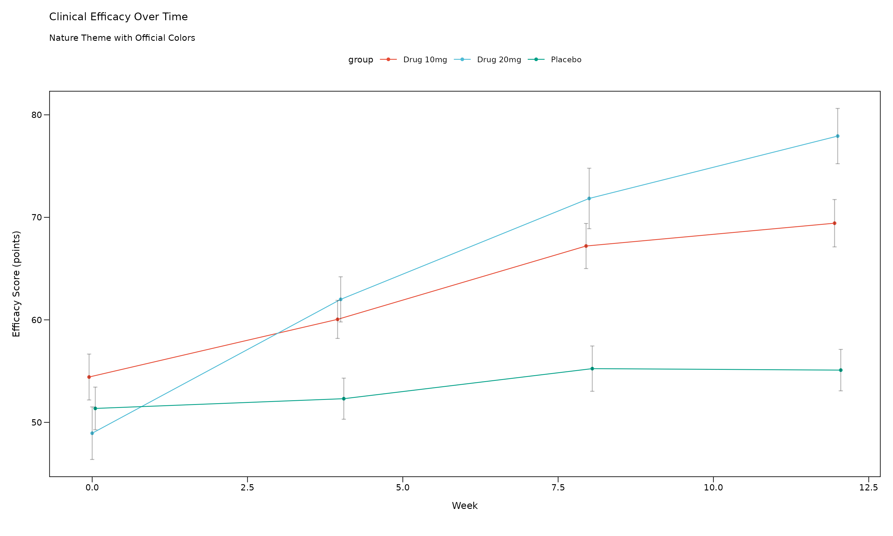

**Nature Theme Features:** - 7pt font size (Nature requirement) - Clean
backgrounds with optional borders - Nature color palette: Cinnabar
(#E64B35), Sky Blue (#4DBBD5), Persian Green (#00A087) - Professional
scientific appearance

### The Lancet

The Lancet theme provides distinctive styling with the journal’s
recognizable color scheme.

``` r

p_lancet <- lplot(demo_data,
                 efficacy ~ visit | treatment,
                 cluster_var = "subject_id",
                 baseline_value = 0, 
                 theme = "lancet",
                 title = "Clinical Efficacy Over Time",
                 subtitle = "Lancet Theme with Official Colors",
                 xlab = "Week",
                 ylab = "Efficacy Score (points)")

p_lancet
```

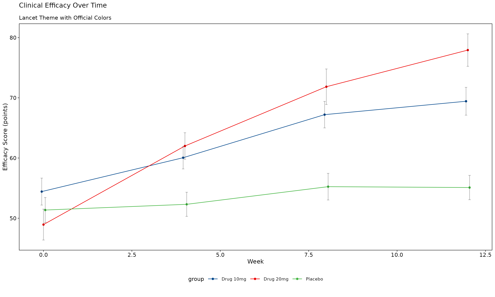

**Lancet Theme Features:** - Deep blue (#00468B) and Lancet red
(#ED0000) signature colors - Professional medical journal styling -
Clear data presentation optimized for clinical research

### Journal of the American Medical Association (JAMA)

The JAMA theme offers conservative, professional styling appropriate for
clinical publications.

``` r

p_jama <- lplot(demo_data,
               efficacy ~ visit | treatment,
               cluster_var = "subject_id",
               baseline_value = 0,
               theme = "jama",
               title = "Clinical Efficacy Over Time",
               subtitle = "JAMA Theme with Official Colors",
               xlab = "Week", 
               ylab = "Efficacy Score (points)")

p_jama
```

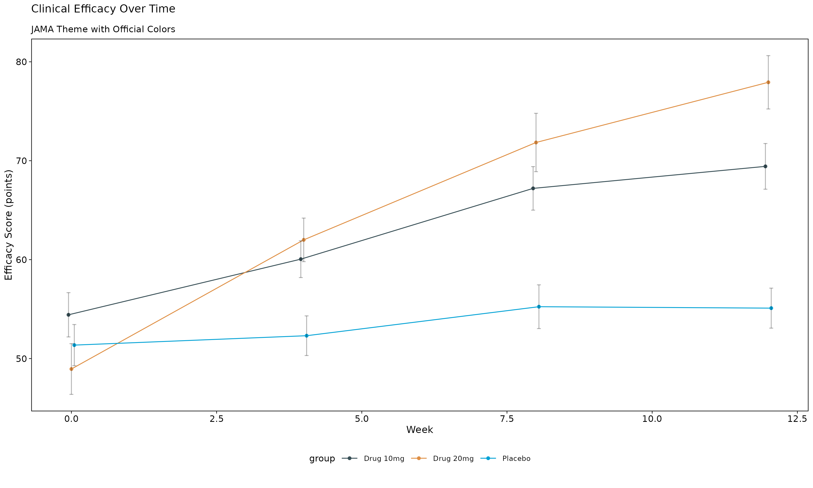

**JAMA Theme Features:** - Conservative color palette with dark
blue-grey (#374E55) and orange (#DF8F44) - Professional typography
suitable for medical publications - Clear, readable design for clinical
data

### Science (AAAS)

The Science theme provides modern scientific styling with the journal’s
official color scheme.

``` r

p_science <- lplot(demo_data,
                  efficacy ~ visit | treatment,
                  cluster_var = "subject_id",
                  baseline_value = 0,
                  theme = "science",
                  title = "Clinical Efficacy Over Time",
                  subtitle = "Science Theme with Official Colors",
                  xlab = "Week",
                  ylab = "Efficacy Score (points)")

p_science
```

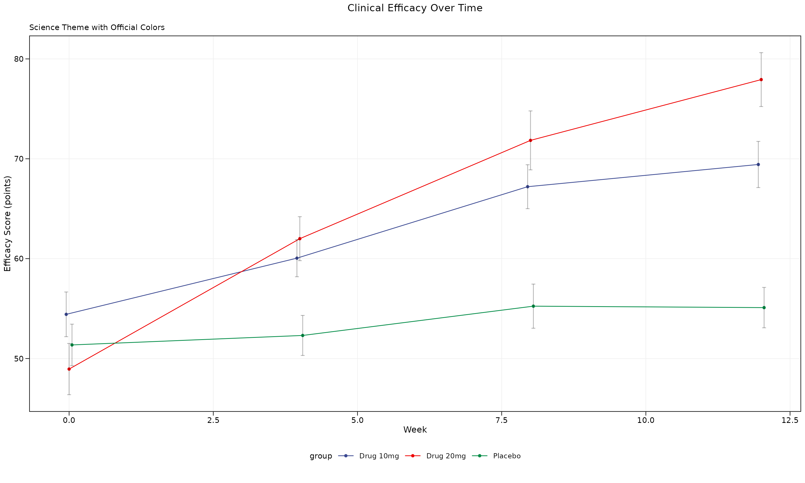

**Science Theme Features:** - 7pt font size (Science requirement) -
Subtle grid lines for data reading - Science color palette: Deep blue
(#3B4992), Red (#EE0000), Green (#008B45)

### Journal of Clinical Oncology (JCO)

The JCO theme is specifically designed for oncology and clinical
research publications.

``` r

p_jco <- lplot(demo_data,
              efficacy ~ visit | treatment, 
              cluster_var = "subject_id",
              baseline_value = 0,
              theme = "jco",
              title = "Clinical Efficacy Over Time",
              subtitle = "JCO Theme with Official Colors",
              xlab = "Week",
              ylab = "Efficacy Score (points)")

p_jco
```

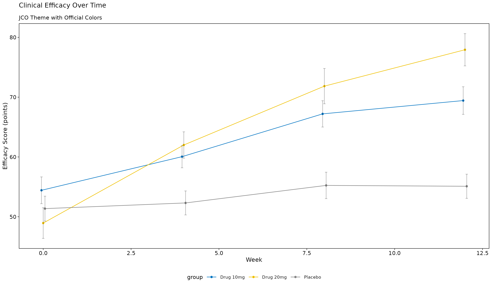

**JCO Theme Features:** - Clinical blue (#0073C2) and yellow (#EFC000)
color scheme - Designed specifically for oncology research -
Professional medical styling

## Regulatory and Clinical Themes

### FDA Regulatory Theme

The FDA theme provides high-contrast styling suitable for regulatory
submissions.

``` r

p_fda <- lplot(demo_data,
              efficacy ~ visit | treatment,
              cluster_var = "subject_id",
              baseline_value = 0,
              theme = "fda",
              title = "Clinical Efficacy Over Time",
              subtitle = "FDA Theme for Regulatory Submissions",
              xlab = "Week",
              ylab = "Efficacy Score (points)")

p_fda
```

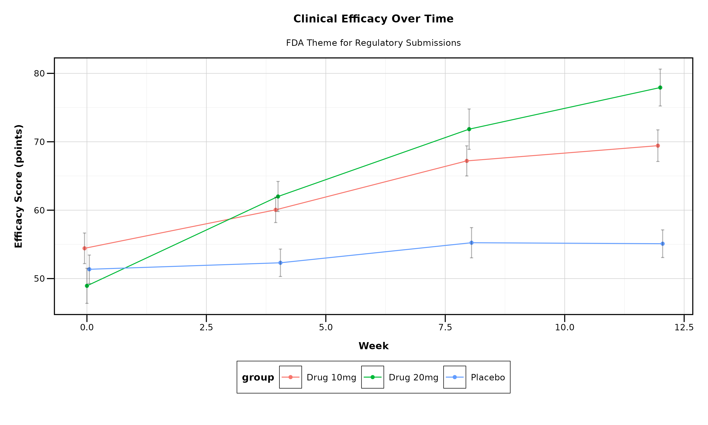

**FDA Theme Features:** - High contrast for regulatory review - 10pt
font size for readability - Grid lines for precise data reading -
Conservative, professional appearance

## Theme Comparison

Let’s create a comprehensive comparison showing multiple themes side by
side:

``` r

# Create simplified plots for comparison
create_comparison_plot <- function(theme_name, title_suffix) {
  lplot(demo_data,
        efficacy ~ visit | treatment,
        cluster_var = "subject_id",
        baseline_value = 0,
        theme = theme_name,
        title = paste("Efficacy Analysis -", title_suffix),
        xlab = "Week",
        ylab = "Efficacy (pts)")
}

# Create all theme variations
p1 <- create_comparison_plot("nejm", "NEJM")
p2 <- create_comparison_plot("nature", "Nature")
p3 <- create_comparison_plot("lancet", "Lancet")
p4 <- create_comparison_plot("jama", "JAMA")
p5 <- create_comparison_plot("science", "Science")
p6 <- create_comparison_plot("jco", "JCO")

# Arrange in grid
(p1 + p2 + p3) / (p4 + p5 + p6)
```

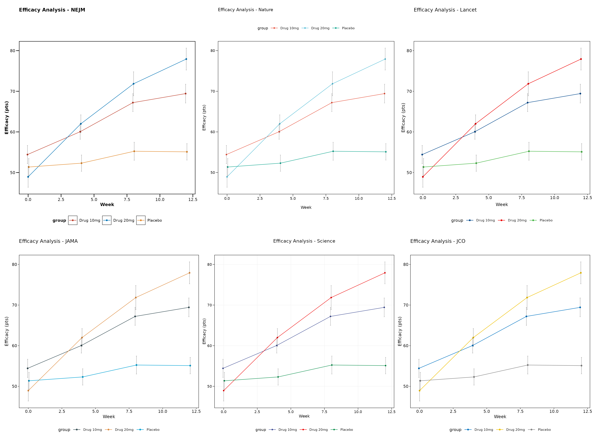

## Using Error Bands vs Error Bars

All themes work with both error bars and error bands. Here’s a
comparison:

``` r

# Error bars (default)
p_bars <- lplot(demo_data,
               efficacy ~ visit | treatment,
               cluster_var = "subject_id",
               baseline_value = 0,
               theme = "nature",
               error_type = "bar",
               jitter_width = 0.15,
               title = "Error Bars with Jitter",
               xlab = "Week",
               ylab = "Efficacy Score")

# Error bands
p_bands <- lplot(demo_data,
                efficacy ~ visit | treatment,
                cluster_var = "subject_id",
                baseline_value = 0,
                theme = "nature",
                error_type = "band",
                title = "Error Bands (Ribbons)",
                xlab = "Week",
                ylab = "Efficacy Score")

p_bars + p_bands
```

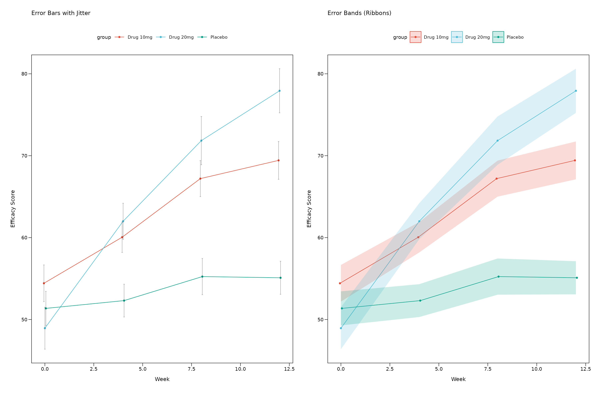

## Ribbon Customization

You can customize the appearance of error bands (ribbons) with
transparency and fill color controls:

``` r

# Create data with some variability for ribbon demonstration
ribbon_demo <- data.frame(
  subject_id = rep(1:25, each = 4),
  visit = rep(c(0, 4, 8, 12), times = 25),
  efficacy = rnorm(100, mean = rep(c(50, 55, 60, 65), times = 25), sd = 8),
  treatment = rep(c("Control", "Treatment"), each = 50)
)

# Default ribbons
p_ribbon_default <- lplot(ribbon_demo, efficacy ~ visit | treatment,
                         cluster_var = "subject_id", baseline_value = 0,
                         error_type = "band",
                         theme = "nature",
                         title = "Default Ribbons (Alpha = 0.2)",
                         xlab = "Week", ylab = "Efficacy Score")

# Custom transparency
p_ribbon_alpha <- lplot(ribbon_demo, efficacy ~ visit | treatment,
                       cluster_var = "subject_id", baseline_value = 0,
                       error_type = "band", ribbon_alpha = 0.5,
                       theme = "nature",
                       title = "Higher Transparency (Alpha = 0.5)",
                       xlab = "Week", ylab = "Efficacy Score")

# Custom fill color
p_ribbon_fill <- lplot(ribbon_demo, efficacy ~ visit | treatment,
                      cluster_var = "subject_id", baseline_value = 0,
                      error_type = "band", 
                      ribbon_alpha = 0.4, ribbon_fill = "lightsteelblue",
                      theme = "nature",
                      title = "Custom Fill Color + Alpha",
                      xlab = "Week", ylab = "Efficacy Score")

# Very transparent for subtle effect
p_ribbon_subtle <- lplot(ribbon_demo, efficacy ~ visit | treatment,
                        cluster_var = "subject_id", baseline_value = 0,
                        error_type = "band", ribbon_alpha = 0.1,
                        theme = "nature",
                        title = "Subtle Ribbons (Alpha = 0.1)",
                        xlab = "Week", ylab = "Efficacy Score")

# Arrange ribbon examples
(p_ribbon_default + p_ribbon_alpha) / (p_ribbon_fill + p_ribbon_subtle)
```

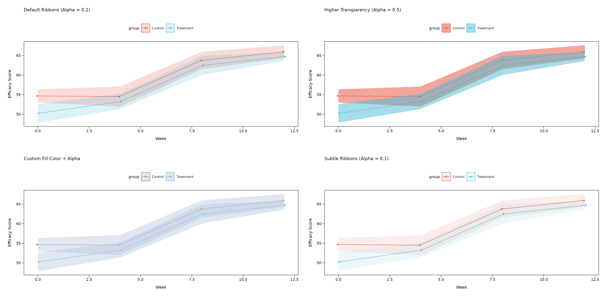

**Ribbon Parameters:**

- **`ribbon_alpha`**: Controls transparency (0 = fully transparent, 1 =
  fully opaque)
  - Default: 0.2 for subtle background effect
  - Higher values (0.4-0.6) for more prominent error regions
  - Lower values (0.1-0.2) for subtle confidence regions
- **`ribbon_fill`**: Controls fill color
  - Default: `NULL` uses group colors automatically
  - Custom colors: `"lightblue"`, `"gray90"`, `"#E8F4F8"`, etc.
  - Useful for creating consistent ribbon colors across groups

## Summary Statistics Options

The `zzlongplot` package supports multiple summary statistics to display
your data:

``` r

# Create test data with some variability
set.seed(42)
n_subjects <- 40
stats_demo <- data.frame(
  subject_id = rep(1:n_subjects, each = 4),
  visit = rep(c(0, 4, 8, 12), times = n_subjects),
  efficacy = c(
    rnorm(n_subjects, mean = 50, sd = 8),      # baseline
    rnorm(n_subjects, mean = 52, sd = 9),      # visit 4 
    rnorm(n_subjects, mean = 55, sd = 10),     # visit 8
    rnorm(n_subjects, mean = 58, sd = 11)      # visit 12
  ),
  treatment = rep(c("Placebo", "Treatment"), each = 80)
)

# Mean ± 95% CI
p_mean_ci <- lplot(stats_demo, efficacy ~ visit | treatment,
                   cluster_var = "subject_id", baseline_value = 0,
                   summary_statistic = "mean", confidence_interval = 0.95,
                   theme = "nature",
                   title = "Mean ± 95% CI",
                   xlab = "Week", ylab = "Efficacy Score")

# Mean ± SE (Standard Error)
p_mean_se <- lplot(stats_demo, efficacy ~ visit | treatment,
                   cluster_var = "subject_id", baseline_value = 0,
                   summary_statistic = "mean_se",
                   theme = "nature",
                   title = "Mean ± SE",
                   xlab = "Week", ylab = "Efficacy Score")

# Median + IQR (Interquartile Range)
p_median <- lplot(stats_demo, efficacy ~ visit | treatment,
                  cluster_var = "subject_id", baseline_value = 0,
                  summary_statistic = "median",
                  theme = "nature",
                  title = "Median + IQR",
                  xlab = "Week", ylab = "Efficacy Score")

# Boxplot summary (Actual boxes + whiskers)
p_boxplot <- lplot(stats_demo, efficacy ~ visit | treatment,
                   cluster_var = "subject_id", baseline_value = 0,
                   summary_statistic = "boxplot",
                   theme = "nature",
                   title = "Boxplots",
                   xlab = "Week", ylab = "Efficacy Score")

# Arrange all plots
(p_mean_ci + p_mean_se) / (p_median + p_boxplot)
```

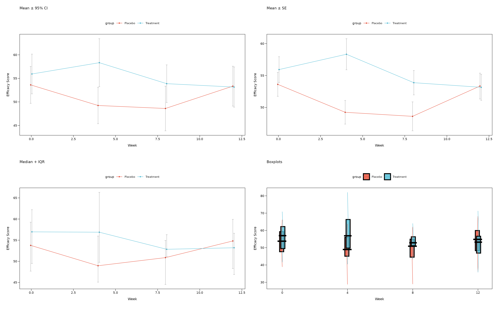

### Summary Statistics Guide

**When to use each option:**

1.  **`summary_statistic = "mean"`** (default):
    - Uses mean as central tendency
    - Error bounds: CI when `confidence_interval` specified, otherwise
      SE
    - Best for: Normally distributed data, regulatory submissions
2.  **`summary_statistic = "mean_se"`**:
    - Always uses mean ± standard error
    - More conservative than CI, faster to compute
    - Best for: Quick exploratory analysis, when SE preferred over CI
3.  **`summary_statistic = "median"`**:
    - Uses median as central tendency with IQR bounds (25th-75th
      percentiles)
    - Robust to outliers
    - Best for: Skewed data, non-parametric analysis
4.  **`summary_statistic = "boxplot"`**:
    - Creates actual boxplots with rectangular boxes showing IQR
    - Median line within each box, whiskers extend to 1.5 × IQR
    - Shows full data distribution and identifies outliers
    - Best for: Exploring data distribution, identifying outliers

## Accessibility and Color Options

### Colorblind-Friendly Alternative

You can override journal colors with colorblind-friendly palettes:

``` r

# Use journal theme but override with accessible colors
p_accessible <- lplot(demo_data,
                     efficacy ~ visit | treatment,
                     cluster_var = "subject_id",
                     baseline_value = 0,
                     theme = "nejm",  # NEJM typography
                     treatment_colors = "standard",  # Colorblind-friendly treatment colors
                     title = "NEJM Theme + Colorblind-Friendly Colors",
                     xlab = "Week",
                     ylab = "Efficacy Score")

p_accessible
```

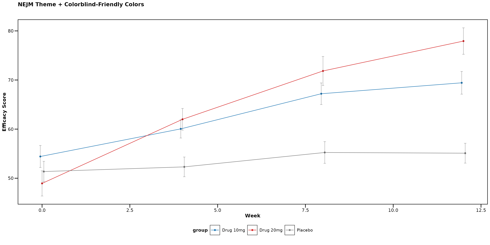

### Available Color Palette Options

``` r

# Journal-specific palettes (auto-applied with themes)
lplot(data, form, theme = "nejm")     # NEJM colors
lplot(data, form, theme = "nature")   # Nature colors
lplot(data, form, theme = "lancet")   # Lancet colors

# Clinical palettes (manual specification)
lplot(data, form, treatment_colors = "standard")  # Clinical trial colors
lplot(data, form, color_palette = clinical_colors("severity"))   # Severity progression
lplot(data, form, color_palette = clinical_colors("fda"))        # FDA high-contrast

# Custom color vectors
lplot(data, form, color_palette = c("#FF0000", "#00FF00", "#0000FF"))
```

## Usage Recommendations

### For Different Journal Submissions

1.  **NEJM**: Use `theme = "nejm"` for clinical trials and medical
    research
2.  **Nature/Science**: Use `theme = "nature"` or `theme = "science"`
    for basic research
3.  **Lancet**: Use `theme = "lancet"` for clinical and epidemiological
    studies
4.  **JAMA**: Use `theme = "jama"` for clinical medicine and healthcare
    research
5.  **JCO**: Use `theme = "jco"` for oncology and cancer research

### For Regulatory Submissions

- **FDA**: Use `theme = "fda"` for high-contrast, regulatory-appropriate
  styling
- **Clinical Study Reports**: Consider `theme = "nejm"` for professional
  medical appearance

### For Accessibility

- Always test with colorblind simulators
- Use `treatment_colors = "standard"` for colorblind-friendly treatment
  colors
- Consider `error_type = "band"` to reduce visual clutter

## Summary

The `zzlongplot` package provides comprehensive theming options for
medical and scientific publications:

- **6 major journal themes** with official color palettes
- **Automatic styling** with single `theme` parameter  
- **Accessibility compliance** with colorblind-friendly options
- **Professional typography** following journal guidelines
- **Flexible customization** with manual color overrides

Choose the appropriate theme based on your target journal or regulatory
requirement, and the package will automatically apply the correct
styling and colors for publication-ready figures.
