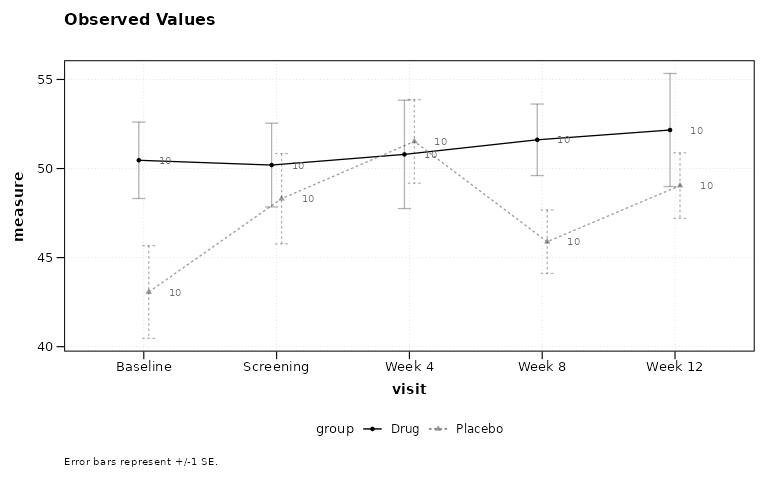

# Quickstart Guide: zzlongplot

## Installation

``` r

# install.packages("pak")
pak::pak("rgt47/zzlongplot")
```

## Setup

``` r

library(zzlongplot)
library(dplyr)
library(ggplot2)
library(patchwork)
```

## Overview

**zzlongplot** is a wrapper around **ggplot2**. It exists to graph
possibly complex longitudinal data with a minimum of syntax: you
describe the data with a formula, and the package does the per-subject
baseline arithmetic, the group-wise summarizing, the error bounds, the
dodging, and the styling.

Two consequences follow, and both matter more than any individual option
in this guide:

1.  **The formula is usually the only thing you have to write.**
    Everything else has a working default.
2.  **The result is an ordinary `ggplot` object.** Anything you know how
    to do in ggplot2 still applies; you are never trapped inside the
    wrapper.

The rest of this section makes both points concrete by putting the
`zzlongplot` call next to the ggplot2 code it replaces.

## Simulated Data

All examples use the following two-arm and three-arm datasets.

``` r

set.seed(42)
n_subj <- 60

subj_info <- data.frame(
  subject_id = 1:n_subj,
  treatment = rep(c("Active", "Placebo"), each = 30)
)

two_arm <- expand.grid(
  subject_id = 1:n_subj,
  visit = c(0, 4, 8, 12)
) |>
  left_join(subj_info, by = "subject_id") |>
  mutate(
    response = 50 +
      visit * ifelse(treatment == "Active", -2.5, -0.5) +
      rnorm(n(), 0, 6)
  )

subj_info3 <- data.frame(
  subject_id = 1:90,
  treatment = rep(
    c("High Dose", "Low Dose", "Placebo"), each = 30
  )
)

three_arm <- expand.grid(
  subject_id = 1:90,
  visit = c(0, 4, 8, 12)
) |>
  left_join(subj_info3, by = "subject_id") |>
  mutate(
    response = 50 +
      visit * ifelse(
        treatment == "High Dose", -3,
        ifelse(treatment == "Low Dose", -1.5, -0.5)
      ) + rnorm(n(), 0, 6)
  )
```

## The Same Figure, Two Ways

### Observed values

The formula `response ~ visit | treatment` reads “response over visit,
split by treatment”. Nothing else is required: the baseline visit is
detected from the data and the subject column defaults to `subject_id`.

#### zzlongplot

``` r

p_zz <- lplot(
  two_arm,
  response ~ visit | treatment
)
```

#### ggplot2

``` r

p_gg <- two_arm |>
  group_by(treatment, visit) |>
  summarise(
    m = mean(response),
    se = sd(response) / sqrt(n()),
    .groups = "drop"
  ) |>
  ggplot(aes(visit, m,
             colour = treatment,
             group = treatment,
             linetype = treatment,
             shape = treatment)) +
  geom_errorbar(
    aes(ymin = m - se, ymax = m + se),
    width = 0.6,
    position = position_dodge(0.15)
  ) +
  geom_line(position = position_dodge(0.15)) +
  geom_point(position = position_dodge(0.15)) +
  scale_colour_grey(start = 0, end = 0.6) +
  labs(x = "visit", y = "measure",
       colour = "group", linetype = "group",
       shape = "group") +
  theme_bw() +
  theme(legend.position = "bottom")
```


Figure 1: zzlongplot (left) and the equivalent hand-written ggplot2
(right).

Three lines against roughly twenty-five. Note what the right-hand column
has to spell out to match the default: the group summary, the standard
error, the dodge applied consistently to three layers, and the redundant
linetype and shape encoding that makes the figure survive grayscale
printing.

Two things the left panel has that the right one does not, because they
are on by default:

- **The per-timepoint sample size.** CONSORT 2025 item 26 requires
  reporting the number of participants with available data at each
  timepoint, and a curve whose denominator silently shrinks hides
  attrition. Pass `show_sample_sizes = FALSE` to suppress it.
- **A caption naming the uncertainty measure.** *Nature* and *Nature
  Medicine* require all error bars to be defined in the figure legend.
  The caption is generated from what was actually computed, so it cannot
  drift from the statistics. Pass your own `caption`, or
  `auto_caption = FALSE`, to take over.

### Change from baseline

The gap widens as the question gets harder. Change from baseline
requires a per-subject lookup of that subject’s baseline value before
any group summarizing can happen. In `zzlongplot` it is one argument.

#### zzlongplot

``` r

p_zz2 <- lplot(
  two_arm,
  response ~ visit | treatment,
  plot_type = "change"
)
```

#### ggplot2

``` r

p_gg2 <- two_arm |>
  group_by(subject_id) |>
  mutate(
    change = response -
      response[visit == 0][1]
  ) |>
  ungroup() |>
  group_by(treatment, visit) |>
  summarise(
    m = mean(change),
    se = sd(change) / sqrt(n()),
    .groups = "drop"
  ) |>
  ggplot(aes(visit, m,
             colour = treatment,
             group = treatment,
             linetype = treatment,
             shape = treatment)) +
  geom_errorbar(
    aes(ymin = m - se, ymax = m + se),
    width = 0.6,
    position = position_dodge(0.15)
  ) +
  geom_line(position = position_dodge(0.15)) +
  geom_point(position = position_dodge(0.15)) +
  scale_colour_grey(start = 0, end = 0.6) +
  labs(x = "visit", y = "measure change",
       colour = "group", linetype = "group",
       shape = "group") +
  theme_bw() +
  theme(legend.position = "bottom")
```


Figure 2: Change from baseline, both routes.

### The result is a ggplot

[`lplot()`](https://rgt47.github.io/zzlongplot/reference/lplot.md)
returns an ordinary `ggplot` object, so the whole of ggplot2 remains
available for anything the wrapper does not cover.

``` r

lplot(two_arm, response ~ visit | treatment) +
  scale_y_continuous(limits = c(0, 70)) +
  labs(title = "Extended after the fact") +
  theme_minimal()
```


Figure 3: Extending the result with ordinary ggplot2 layers.

One exception is worth knowing early: with `plot_type = "both"` the
return is a `patchwork` of two panels rather than a single `ggplot`. It
still prints and still saves with
[`ggsave()`](https://ggplot2.tidyverse.org/reference/ggsave.html), but
`+` then adds to the composition rather than to one panel.

## Basic Usage

The remaining examples pass `baseline_value` explicitly and add titles
and captions, since that is what a real figure needs.

### Observed Values with Error Bars

``` r

lplot(two_arm,
  response ~ visit | treatment,
  baseline_value = 0,
  title = "Observed Values: Error Bars")
```


Figure 4: Observed values with error bars (default).

### Observed Values with Confidence Ribbons

``` r

lplot(two_arm,
  response ~ visit | treatment,
  baseline_value = 0,
  error_type = "band",
  title = "Observed Values: Confidence Ribbons")
```


Figure 5: Observed values with confidence ribbons.

### Change from Baseline

``` r

lplot(two_arm,
  response ~ visit | treatment,
  baseline_value = 0,
  plot_type = "change",
  title = "Change from Baseline")
```


Figure 6: Change from baseline plot.

### Combined Plot

``` r

lplot(two_arm,
  response ~ visit | treatment,
  baseline_value = 0,
  plot_type = "both",)
```


Figure 7: Side-by-side observed and change plots.

## Sample Size Annotations

Per-group sample sizes are shown at each timepoint by default, as
in-plot labels. The alternative is a color-coded table below the x-axis,
the layout familiar from the numbers-at-risk row under a Kaplan-Meier
curve.

``` r

lplot(two_arm,
  response ~ visit | treatment,
  baseline_value = 0,
  title = "With Sample Size Labels")
```


Figure 8: Sample sizes as point labels (default).

``` r

lplot(two_arm,
  response ~ visit | treatment,
  baseline_value = 0,
  sample_size_opts = list(position = "table"),
  title = "With Sample Size Table")
```


Figure 9: Sample size table below axis.

To suppress the annotation entirely, pass `show_sample_sizes = FALSE`.

``` r

lplot(two_arm,
  response ~ visit | treatment,
  baseline_value = 0,
  show_sample_sizes = FALSE,
  title = "Without Sample Size Labels")
```


Figure 10: Sample size annotation suppressed.

## Statistical Annotations

### Two-Group Comparison

Stars appear above timepoints where the adjusted p-value crosses
standard significance thresholds.

``` r

lplot(two_arm,
  response ~ visit | treatment,
  baseline_value = 0,
  statistical_annotations = TRUE,
  title = "Two-Group: Significance Stars")
```


Figure 11: Two-group significance stars.

### Three-Group Comparison with Pairwise Brackets

For three or more groups, pairwise brackets with significance stars are
displayed at each timepoint.

``` r

lplot(three_arm,
  response ~ visit | treatment,
  cluster_var = "subject_id",
  baseline_value = 0,
  statistical_annotations = TRUE,
  title = "Three-Group: Pairwise Brackets")
```


Figure 12: Three-group pairwise brackets.

## Contrast Display

When using `test_method = "mmrm"`, emmeans contrast results (LS mean
difference, 95% CI, p-value) can be displayed as a footnote or a table
below the plot.

This requires the suggested packages **mmrm** and **emmeans**. The two
figures in this section are only built when both are installed.

### Footnote Mode

``` r

lplot(two_arm,
  response ~ visit | treatment,
  baseline_value = 0,
  statistical_annotations = TRUE,
  test_method = "mmrm",
  contrast_display = "footnote",
  title = "MMRM: Contrast Footnote")
```


Figure 13: MMRM with contrast footnote.

### Table Mode

``` r

lplot(two_arm,
  response ~ visit | treatment,
  baseline_value = 0,
  statistical_annotations = TRUE,
  test_method = "mmrm",
  contrast_display = "table",
  title = "MMRM: Contrast Table")
```


Figure 14: MMRM with contrast table.

## Publication Themes

### Black-and-White Print Theme

This is the default. Groups are distinguished redundantly by linetype
and point shape as well as by color, and the palette itself is
grayscale, so the figure survives grayscale printing and photocopying.

``` r

lplot(two_arm,
  response ~ visit | treatment,
  baseline_value = 0,
  title = "Black-and-White Theme (Default)")
```


Figure 15: Black-and-white print theme (default).

### NEJM Theme

Pass the theme by name through `theme =`. This applies the journal’s
typography **and** its official color palette in one step. Adding
`+ theme_nejm()` to a finished plot changes only the typography, so the
colors would stay on the default grayscale palette.

``` r

lplot(two_arm,
  response ~ visit | treatment,
  baseline_value = 0,
  theme = "nejm",
  title = "NEJM Theme")
```


Figure 16: NEJM journal theme.

## Tips

### Ordering Categorical Visit Labels

When the x-axis variable is character or factor (e.g., visit names
rather than numeric week numbers), R defaults to alphabetical order.
Convert to a factor with explicit levels before calling
[`lplot()`](https://rgt47.github.io/zzlongplot/reference/lplot.md):

``` r

visit_labels <- c("Screening", "Baseline", "Week 4", "Week 8", "Week 12")

labelled <- data.frame(
  subject_id = rep(seq_len(20), each = 5),
  visit = rep(visit_labels, times = 20),
  treatment = rep(c("Drug", "Placebo"), each = 5, length.out = 100),
  response = rnorm(100, mean = 50, sd = 8)
)

# Without this step the x-axis would run Baseline, Screening, Week 12,
# Week 4, Week 8 -- alphabetical rather than chronological.
labelled$visit <- factor(labelled$visit, levels = visit_labels)

lplot(labelled, response ~ visit | treatment,
  cluster_var = "subject_id",
  baseline_value = "Baseline")
```



Numeric visit variables (e.g., `visit = c(0, 4, 8, 12)`) are sorted
numerically by default and do not require this step.

## Quick Reference

### Formula Syntax

    outcome ~ time | group

- `outcome`: Response variable (y-axis)
- `time`: Time variable (x-axis)
- `group`: Grouping variable (colors/lines)

### Key Parameters

| Parameter | Description | Default |
|:---|:---|:---|
| `plot_type` | “obs”, “change”, or “both” | “obs” |
| `error_type` | “bar” or “band” | “bar” |
| `baseline_value` | Value identifying baseline | NULL |
| `show_sample_sizes` | Show N at each timepoint | FALSE |
| `statistical_annotations` | Significance annotations | FALSE |
| `test_method` | “parametric”, “nonparametric”, or “mmrm” | “parametric” |
| `p_adjust_method` | Multiplicity correction | “BH” |
| `contrast_display` | “footnote” or “table” (MMRM) | NULL |
| `summary_statistic` | “mean”, “mean_se”, “median”, “boxplot” | “mean” |
| `confidence_interval` | Level for CI bounds, e.g. `0.95`; `NULL` gives +/-1 SE | NULL |
| `theme` | “bw”, “nejm”, “nature”, “lancet”, “jama”, “science”, “jco”, “fda”, “default” | NULL (see below) |
| `cluster_var` | Subject ID column | “subject_id” |
| `facet_form` | Faceting formula (e.g., `~ site`) | NULL |

`theme = NULL` resolves to `"bw"` for a plain call, to `"nejm"` under
`clinical_mode = TRUE`, and to `"nature"` under
`publication_ready = TRUE`. Passing `theme` explicitly overrides all of
these.

Note that `confidence_interval` applies only to `summary_statistic`
values `"mean"` and `"median"`. With `"mean_se"` the bars are always
+/-1 standard error, and with `"boxplot"` they are quartiles and
whiskers; in both cases no confidence level is claimed.

## Next Steps

- [`vignette("zzlongplot_introduction")`](https://rgt47.github.io/zzlongplot/articles/zzlongplot_introduction.md)
  – Detailed introduction
- [`vignette("mmrm-analysis")`](https://rgt47.github.io/zzlongplot/articles/mmrm-analysis.md)
  – MMRM analysis workflow
- [`vignette("clinical-trials")`](https://rgt47.github.io/zzlongplot/articles/clinical-trials.md)
  – Clinical trial applications
- [`vignette("cdisc-compliance")`](https://rgt47.github.io/zzlongplot/articles/cdisc-compliance.md)
  – CDISC-compliant workflows
- [`vignette("publication-themes")`](https://rgt47.github.io/zzlongplot/articles/publication-themes.md)
  – Publication-ready themes
