# Sample Size Annotations

## Overview

Displaying the sample size contributing to each plotted summary is
standard practice in clinical trial figures and longitudinal research.
The `show_sample_sizes` parameter in
[`lplot()`](https://rgt47.github.io/zzlongplot/reference/lplot.md)
places the count next to each point. The companion `sample_size_opts`
list controls appearance (font size, color, transparency) and placement
(horizontal and vertical offsets).

## Sample Data

We use two datasets throughout this vignette: one with continuous time
and two treatment groups, and one with categorical visits and three
treatment arms.

``` r

set.seed(42)

continuous_df <- data.frame(
  subject_id = rep(1:60, each = 4),
  week = rep(c(0, 4, 8, 12), times = 60),
  score = NA,
  arm = rep(
    c("Drug", "Placebo"), each = 4, length.out = 240
  )
)

for (s in unique(continuous_df$subject_id)) {
  rows <- continuous_df$subject_id == s
  bl <- 50 + rnorm(1, 0, 5)
  is_drug <- continuous_df$arm[rows][1] == "Drug"
  fx <- if (is_drug) c(0, 3, 6, 10) else c(0, 1, 1.5, 2)
  continuous_df$score[rows] <- bl + fx + rnorm(4, 0, 3)
}

categorical_df <- data.frame(
  subject_id = rep(1:45, each = 3),
  visit = rep(
    c("Baseline", "Month 3", "Month 6"), times = 45
  ),
  outcome = NA,
  treatment = rep(
    c("Active A", "Active B", "Placebo"),
    each = 3, length.out = 135
  )
)

for (s in unique(categorical_df$subject_id)) {
  rows <- categorical_df$subject_id == s
  bl <- 30 + rnorm(1, 0, 4)
  trt <- categorical_df$treatment[rows][1]
  fx <- switch(trt,
    "Active A" = c(0, 5, 9),
    "Active B" = c(0, 3, 5),
    "Placebo"  = c(0, 1, 2)
  )
  categorical_df$outcome[rows] <- bl + fx + rnorm(3, 0, 2)
}
```

## Default Sample Sizes

Setting `show_sample_sizes = TRUE` with no additional options places the
count to the right of each point using default styling (size 2.8,
grey40, full opacity).

``` r

lplot(continuous_df,
      score ~ week | arm,
      cluster_var = "subject_id",
      baseline_value = 0,
      show_sample_sizes = TRUE,
      title = "Default Sample Size Labels",
      xlab = "Week",
      ylab = "Score")
```

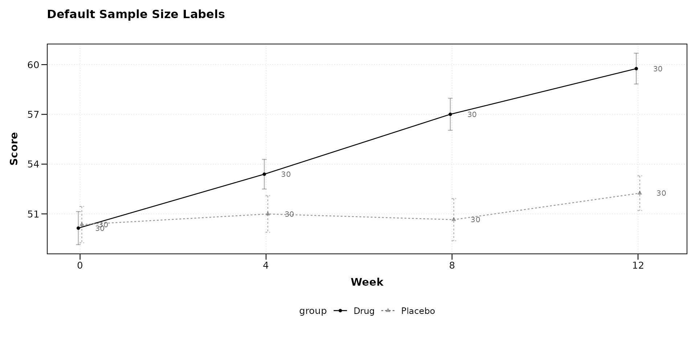

## Adjusting Font Size

Larger labels may be appropriate for presentations; smaller labels work
better for dense multi-panel figures.

``` r

lplot(continuous_df,
      score ~ week | arm,
      cluster_var = "subject_id",
      baseline_value = 0,
      show_sample_sizes = TRUE,
      sample_size_opts = list(size = 4.5),
      title = "Larger Labels (size = 4.5)",
      xlab = "Week",
      ylab = "Score")
```

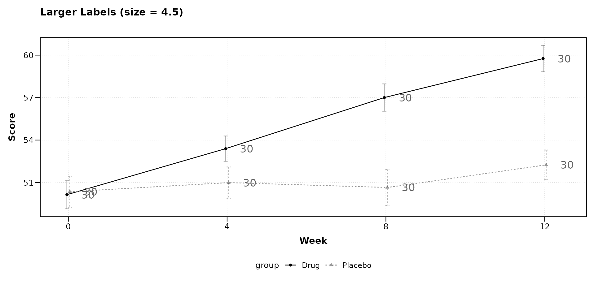

``` r

lplot(categorical_df,
      outcome ~ visit | treatment,
      cluster_var = "subject_id",
      baseline_value = "Baseline",
      show_sample_sizes = TRUE,
      sample_size_opts = list(size = 2),
      title = "Smaller Labels (size = 2)",
      xlab = "Visit",
      ylab = "Outcome")
```

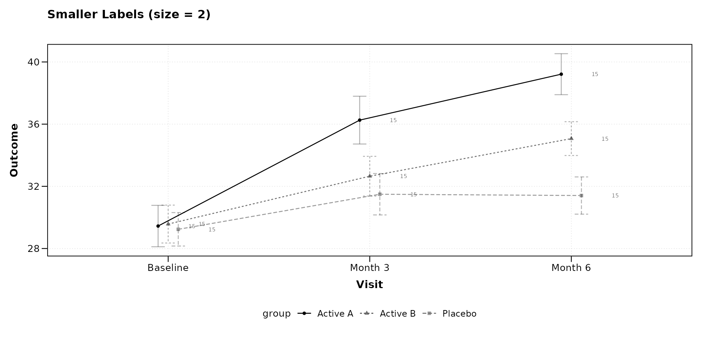

## Changing Color

The label color can be set to any valid R color string. Using black
increases contrast; using a muted tone keeps labels subordinate to the
data.

``` r

lplot(continuous_df,
      score ~ week | arm,
      cluster_var = "subject_id",
      baseline_value = 0,
      show_sample_sizes = TRUE,
      sample_size_opts = list(color = "black"),
      title = "Black Labels",
      xlab = "Week",
      ylab = "Score")
```

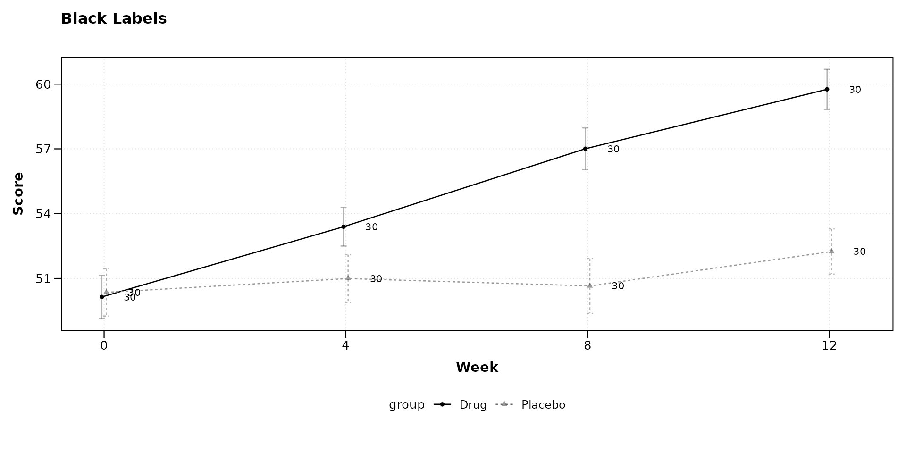

``` r

lplot(continuous_df,
      score ~ week | arm,
      cluster_var = "subject_id",
      baseline_value = 0,
      show_sample_sizes = TRUE,
      sample_size_opts = list(color = "steelblue", size = 3.2),
      title = "Steelblue Labels",
      xlab = "Week",
      ylab = "Score")
```

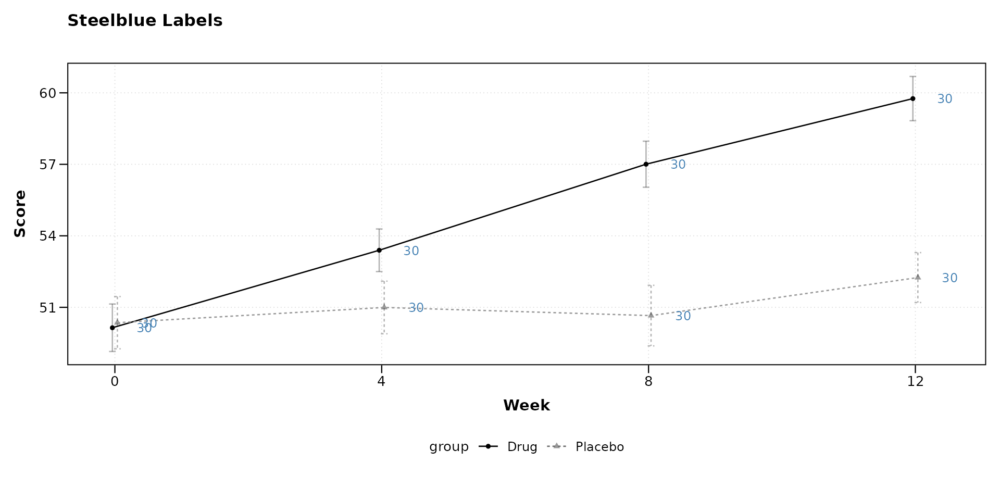

## Transparency

Setting `alpha` below 1 fades the labels so they do not compete with the
plotted data.

``` r

lplot(categorical_df,
      outcome ~ visit | treatment,
      cluster_var = "subject_id",
      baseline_value = "Baseline",
      show_sample_sizes = TRUE,
      sample_size_opts = list(alpha = 0.4),
      title = "Semi-Transparent Labels (alpha = 0.4)",
      xlab = "Visit",
      ylab = "Outcome")
```

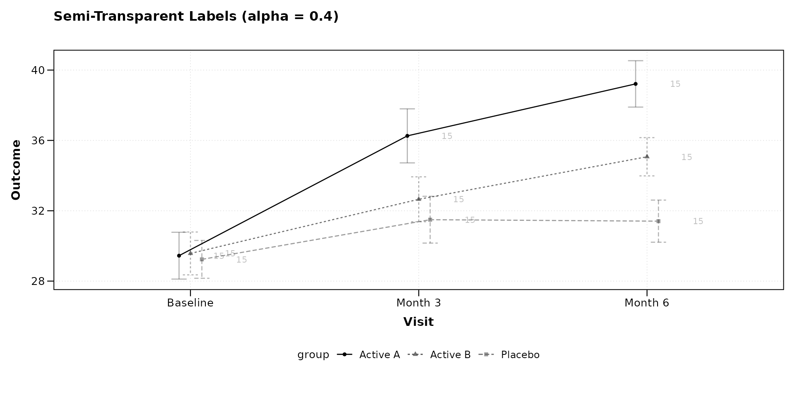

## Horizontal Placement

The `nudge_x` option controls how far the label sits from the point
along the x-axis. Positive values shift right; negative values shift
left. For continuous x variables the unit is in data units; for
categorical x variables it is a fraction of category spacing.

``` r

lplot(continuous_df,
      score ~ week | arm,
      cluster_var = "subject_id",
      baseline_value = 0,
      show_sample_sizes = TRUE,
      sample_size_opts = list(nudge_x = 0.8),
      title = "Wider Horizontal Offset (nudge_x = 0.8)",
      xlab = "Week",
      ylab = "Score")
```

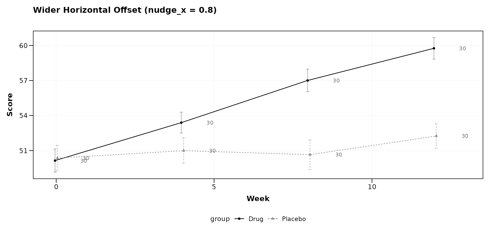

``` r

lplot(categorical_df,
      outcome ~ visit | treatment,
      cluster_var = "subject_id",
      baseline_value = "Baseline",
      show_sample_sizes = TRUE,
      sample_size_opts = list(nudge_x = 0.05),
      title = "Tight Horizontal Offset (nudge_x = 0.05)",
      xlab = "Visit",
      ylab = "Outcome")
```

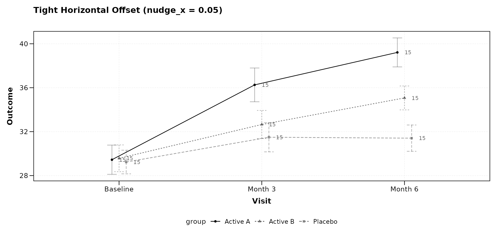

## Vertical Placement

The `nudge_y` option shifts labels up (positive) or down (negative) in
data units. This is useful when error bars or ribbons would otherwise
overlap with the labels.

``` r

lplot(continuous_df,
      score ~ week | arm,
      cluster_var = "subject_id",
      baseline_value = 0,
      show_sample_sizes = TRUE,
      sample_size_opts = list(nudge_y = 2),
      title = "Labels Shifted Up (nudge_y = 2)",
      xlab = "Week",
      ylab = "Score")
```

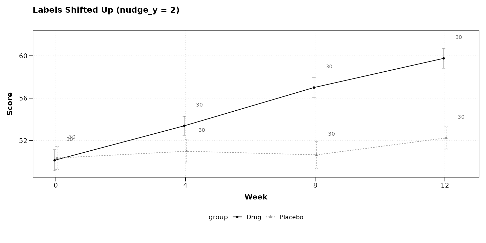

``` r

lplot(continuous_df,
      score ~ week | arm,
      cluster_var = "subject_id",
      baseline_value = 0,
      show_sample_sizes = TRUE,
      sample_size_opts = list(nudge_y = -2),
      title = "Labels Shifted Down (nudge_y = -2)",
      xlab = "Week",
      ylab = "Score")
```

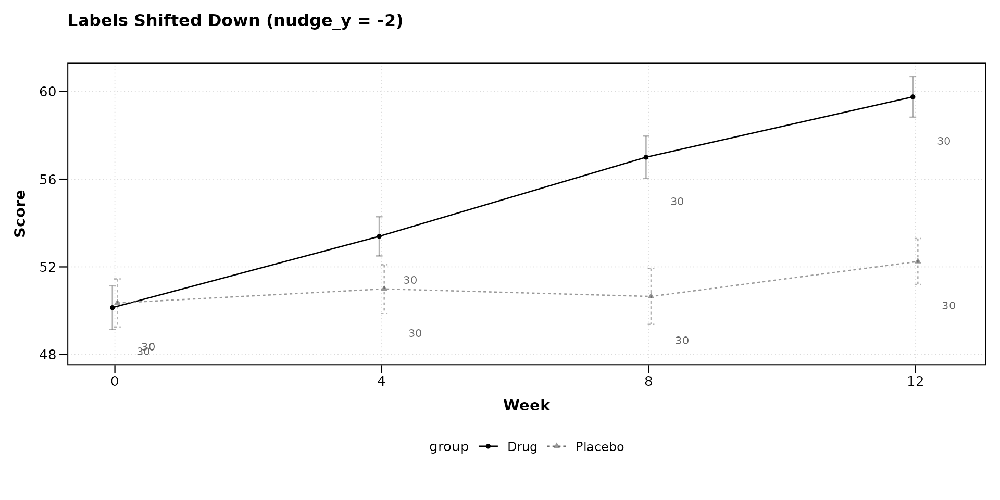

## Combining Options

Multiple options can be set together. The following example uses a
larger font, black color, reduced transparency, and a downward vertical
offset.

``` r

lplot(categorical_df,
      outcome ~ visit | treatment,
      cluster_var = "subject_id",
      baseline_value = "Baseline",
      show_sample_sizes = TRUE,
      sample_size_opts = list(
        size = 3.5,
        color = "black",
        alpha = 0.6,
        nudge_y = -1.5
      ),
      title = "Combined: size, color, alpha, nudge_y",
      xlab = "Visit",
      ylab = "Outcome")
```


## With Change-from-Baseline Plots

Sample size labels appear on both observed and change panels when
`plot_type = "both"`. The same `sample_size_opts` apply to both panels.

``` r

lplot(continuous_df,
      score ~ week | arm,
      cluster_var = "subject_id",
      baseline_value = 0,
      plot_type = "both",
      show_sample_sizes = TRUE,
      sample_size_opts = list(
        size = 3, color = "grey30", alpha = 0.7
      ),
      title = "Observed Values",
      title2 = "Change from Baseline",
      xlab = "Week",
      ylab = "Score",
      ylab2 = "Score Change")
```

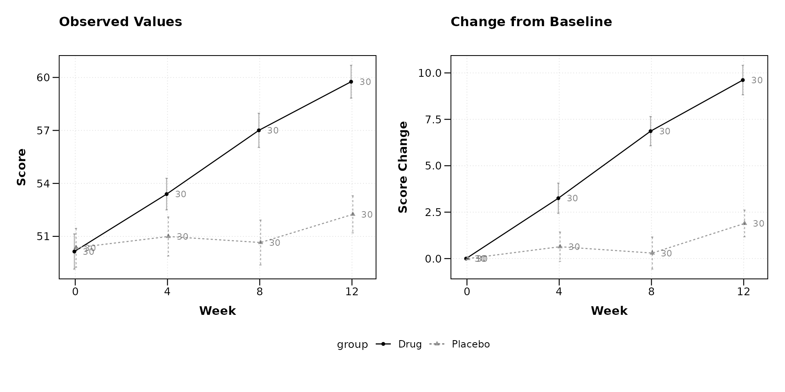

## With BW Print Theme

The black-and-white theme pairs well with sample size annotations for
figures destined for monochrome printing.

``` r

lplot(categorical_df,
      outcome ~ visit | treatment,
      cluster_var = "subject_id",
      baseline_value = "Baseline",
      theme = "bw",
      plot_type = "both",
      show_sample_sizes = TRUE,
      sample_size_opts = list(
        size = 3, color = "black", alpha = 0.5
      ),
      title = "Observed (BW)",
      title2 = "Change (BW)",
      xlab = "Visit",
      ylab = "Outcome",
      ylab2 = "Outcome Change")
```

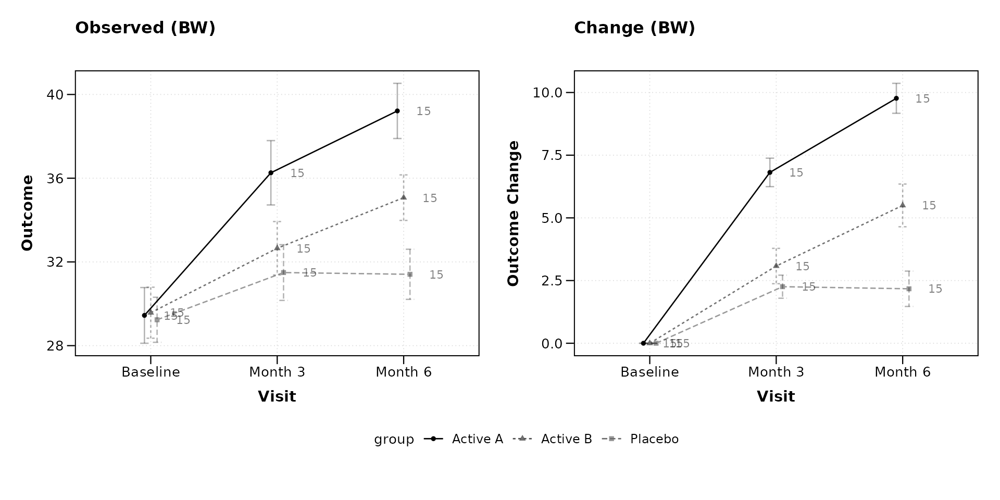

## With Error Bands

When using ribbon-style error bands, shifting labels vertically can
prevent overlap with the shaded region.

``` r

lplot(continuous_df,
      score ~ week | arm,
      cluster_var = "subject_id",
      baseline_value = 0,
      error_type = "band",
      show_sample_sizes = TRUE,
      sample_size_opts = list(
        nudge_y = 3, size = 3, color = "grey20"
      ),
      title = "Error Bands with Elevated Labels",
      xlab = "Week",
      ylab = "Score")
```

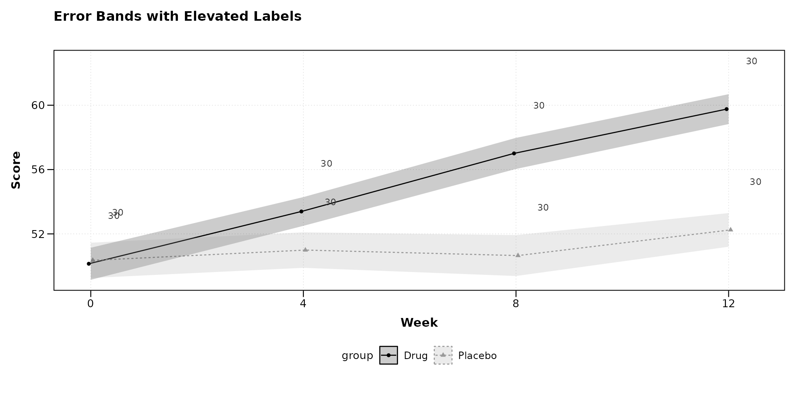

## Parameter Reference

The `sample_size_opts` list accepts the following elements. All are
optional; omitted elements use their defaults.

| Option    | Default  | Description                      |
|:----------|:---------|:---------------------------------|
| `size`    | 2.8      | Font size in mm                  |
| `color`   | “grey40” | Label color (any R color)        |
| `alpha`   | 1        | Transparency, 0 (invisible) to 1 |
| `nudge_x` | auto     | Horizontal offset from point     |
| `nudge_y` | 0        | Vertical offset from point       |

When `nudge_x` is not specified, it is automatically calculated as 3% of
the x-axis range for continuous variables or 0.15 category units for
categorical variables.

## Session Info

``` r

sessionInfo()
```

    #> R version 4.6.0 (2026-04-24)
    #> Platform: x86_64-pc-linux-gnu
    #> Running under: Ubuntu 24.04.4 LTS
    #> 
    #> Matrix products: default
    #> BLAS:   /usr/lib/x86_64-linux-gnu/openblas-pthread/libblas.so.3 
    #> LAPACK: /usr/lib/x86_64-linux-gnu/openblas-pthread/libopenblasp-r0.3.26.so;  LAPACK version 3.12.0
    #> 
    #> locale:
    #>  [1] LC_CTYPE=C.UTF-8       LC_NUMERIC=C           LC_TIME=C.UTF-8       
    #>  [4] LC_COLLATE=C.UTF-8     LC_MONETARY=C.UTF-8    LC_MESSAGES=C.UTF-8   
    #>  [7] LC_PAPER=C.UTF-8       LC_NAME=C              LC_ADDRESS=C          
    #> [10] LC_TELEPHONE=C         LC_MEASUREMENT=C.UTF-8 LC_IDENTIFICATION=C   
    #> 
    #> time zone: UTC
    #> tzcode source: system (glibc)
    #> 
    #> attached base packages:
    #> [1] stats     graphics  grDevices utils     datasets  methods   base     
    #> 
    #> other attached packages:
    #> [1] ggplot2_4.0.3    dplyr_1.2.1      zzlongplot_0.2.0
    #> 
    #> loaded via a namespace (and not attached):
    #>  [1] gtable_0.3.6       jsonlite_2.0.0     compiler_4.6.0     tidyselect_1.2.1  
    #>  [5] jquerylib_0.1.4    systemfonts_1.3.2  scales_1.4.0       textshaping_1.0.5 
    #>  [9] yaml_2.3.12        fastmap_1.2.0      R6_2.6.1           labeling_0.4.3    
    #> [13] generics_0.1.4     patchwork_1.3.2    knitr_1.51         tibble_3.3.1      
    #> [17] desc_1.4.3         bslib_0.10.0       pillar_1.11.1      RColorBrewer_1.1-3
    #> [21] rlang_1.2.0        cachem_1.1.0       xfun_0.57          fs_2.1.0          
    #> [25] sass_0.4.10        S7_0.2.2           cli_3.6.6          withr_3.0.2       
    #> [29] pkgdown_2.2.0      magrittr_2.0.5     digest_0.6.39      grid_4.6.0        
    #> [33] lifecycle_1.0.5    vctrs_0.7.3        evaluate_1.0.5     glue_1.8.1        
    #> [37] farver_2.1.2       ragg_1.5.2         rmarkdown_2.31     tools_4.6.0       
    #> [41] pkgconfig_2.0.3    htmltools_0.5.9
