# zzlongplot: A Flexible Framework for Longitudinal Data Visualization

## Introduction

Longitudinal data visualization presents unique challenges that require
specialized plotting solutions. The `zzlongplot` package addresses these
challenges by providing a comprehensive, flexible framework for creating
publication-quality visualizations of longitudinal data in R. Whether
you’re conducting clinical trials, educational assessments, or any
research with repeated measurements over time, `zzlongplot` offers
intuitive functions that streamline the creation of both observed value
plots and change-from-baseline visualizations.

### The Challenge of Longitudinal Data Visualization

Researchers working with longitudinal data typically need to answer two
fundamental questions:

1.  How do measurements change over time?
2.  How do these changes differ between groups or conditions?

To address these questions effectively, visualizations must:

- Display observed values at each time point
- Show changes relative to baseline measures
- Represent uncertainty appropriately
- Allow comparisons across different groups
- Accommodate both continuous time points (e.g., days, years) and
  categorical time points (e.g., “baseline”, “month1”, “month2”)
- Support faceting to explore interactions with additional variables

While base R graphics and packages like `ggplot2` provide powerful
visualization capabilities, creating consistent, publication-ready
longitudinal plots often requires extensive custom code. `zzlongplot`
fills this gap by offering a specialized suite of functions designed
specifically for longitudinal data visualization.

### Key Features of zzlongplot

The `zzlongplot` package offers several advantages for researchers
working with longitudinal data:

#### 1. Flexible Data Structure Support

- Works with both continuous and categorical time variables
- Handles both balanced and unbalanced designs
- Supports grouped data for comparing different conditions
- Allows for flexible specification of baseline values

#### 2. Comprehensive Visualization Options

- Generate observed value plots showing raw measurements over time
- Create change-from-baseline plots highlighting differences from
  starting points
- Combine both plot types side-by-side for comprehensive reporting
- Customize axis labels, titles, and other plot elements

#### 3. Statistical Representation Choices

- Visualize uncertainty with either error bars or confidence ribbons
- Automatically calculate and display standard errors
- Handle within-subject clustering for more accurate error estimation

#### 4. Formula-Based Interface

`zzlongplot` employs a formula-based interface similar to those used in
statistical modeling functions, making it intuitive for R users:

``` r

# Basic usage
lplot(data, y ~ x | group)

# With faceting
lplot(data, y ~ x | group, facet_form = facet_y ~ facet_x)
```

This consistent syntax provides a familiar experience while offering
substantial flexibility.

#### 5. Integrated Theming and Styling

- Built-in support for colorblind-friendly palettes
- Consistent, publication-ready styling defaults
- Easy customization for specific journal requirements

### Package Architecture

The `zzlongplot` package consists of several core functions:

- [`lplot()`](https://rgt47.github.io/zzlongplot/reference/lplot.md):
  The main user-facing function that creates longitudinal plots
- [`parse_formula()`](https://rgt47.github.io/zzlongplot/reference/parse_formula.md):
  Processes the formula notation that specifies the plotting variables
- [`compute_stats()`](https://rgt47.github.io/zzlongplot/reference/compute_stats.md):
  Calculates summary statistics for different groups and time points
- [`generate_plot()`](https://rgt47.github.io/zzlongplot/reference/generate_plot.md):
  Creates the actual visualizations using ggplot2
- [`get_colorblind_palette()`](https://rgt47.github.io/zzlongplot/reference/get_colorblind_palette.md):
  Provides accessible color schemes for plots

These functions work together to deliver a streamlined workflow for
creating sophisticated longitudinal visualizations with minimal code.

## Getting Started with zzlongplot

Let’s begin by creating a sample dataset with longitudinal measurements
that we’ll use throughout this vignette.

### Creating Sample Data

First, we’ll create a dataset with continuous time points:

``` r

# Set seed for reproducibility
set.seed(123)

# Create sample data with continuous time points
continuous_data <- data.frame(
  subject_id = rep(1:50, each = 4),
  visit_time = rep(c(0, 4, 8, 12), times = 50),  # Weeks from baseline
  outcome = NA,  # Will fill this with simulated data
  group = rep(c("Treatment", "Placebo"), each = 2, length.out = 200)
)

# Generate outcome data with treatment effect increasing over time
for (subject in unique(continuous_data$subject_id)) {
  subject_rows <- which(continuous_data$subject_id == subject)
  baseline <- 50 + rnorm(1, 0, 5)  # Baseline value with some variation
  
  is_treatment <- continuous_data$group[subject_rows[1]] == "Treatment"
  
  # Treatment effect increases over time, placebo has minimal effect
  effect_size <- if (is_treatment) c(0, 3, 7, 12) else c(0, 1, 1.5, 2)
  
  # Add individual trajectory with some random noise
  continuous_data$outcome[subject_rows] <- baseline + effect_size + rnorm(4, 0, 3)
}

# Look at the first few rows of our data
head(continuous_data, 8)
```

    #>   subject_id visit_time  outcome     group
    #> 1          1          0 46.50709 Treatment
    #> 2          1          4 54.87375 Treatment
    #> 3          1          8 54.40915   Placebo
    #> 4          1         12 59.58548   Placebo
    #> 5          2          0 59.95807 Treatment
    #> 6          2          4 57.78014 Treatment
    #> 7          2          8 63.51477   Placebo
    #> 8          2         12 69.23834   Placebo

Next, let’s create a dataset with categorical time points:

``` r

# Create sample data with categorical time points
categorical_data <- data.frame(
  subject_id = rep(1:50, each = 4),
  visit = rep(c("Baseline", "Month1", "Month3", "Month6"), times = 50),
  score = NA,  # Will fill this with simulated data
  treatment = rep(c("Drug A", "Drug B", "Placebo"), length.out = 50, each = 4),
  site = rep(c("Site 1", "Site 2"), length.out = 200)  # For faceting examples
)

# Generate score data with different treatment effects
for (subject in unique(categorical_data$subject_id)) {
  subject_rows <- which(categorical_data$subject_id == subject)
  baseline <- 25 + rnorm(1, 0, 3)  # Baseline value
  
  # Different effects for different treatments
  treatment_type <- categorical_data$treatment[subject_rows[1]]
  
  if (treatment_type == "Drug A") {
    effect_size <- c(0, 5, 8, 10)  # Strong effect
  } else if (treatment_type == "Drug B") {
    effect_size <- c(0, 4, 5, 7)   # Moderate effect
  } else {
    effect_size <- c(0, 2, 2, 3)   # Weak effect (placebo)
  }
  
  # Add individual trajectory with some random noise
  categorical_data$score[subject_rows] <- baseline + effect_size + rnorm(4, 0, 2)
}

# Look at the first few rows of our data
head(categorical_data, 8)
```

    #>   subject_id    visit    score treatment   site
    #> 1          1 Baseline 22.74944    Drug A Site 1
    #> 2          1   Month1 28.18536    Drug A Site 2
    #> 3          1   Month3 32.05418    Drug A Site 1
    #> 4          1   Month6 37.07021    Drug A Site 2
    #> 5          2 Baseline 26.89590    Drug B Site 1
    #> 6          2   Month1 29.99581    Drug B Site 2
    #> 7          2   Month3 29.50702    Drug B Site 1
    #> 8          2   Month6 28.66850    Drug B Site 2

### Basic Usage: Simple Longitudinal Plot

Let’s start with the most basic usage of `zzlongplot`: creating a simple
plot of outcome over time.

``` r

# Basic plot showing outcome over time
lplot(continuous_data, 
      form = outcome ~ visit_time,
      cluster_var = "subject_id",
      baseline_value = 0,
      title = "Outcome Over Time",
      xlab = "Weeks",
      ylab = "Outcome Measure")
```

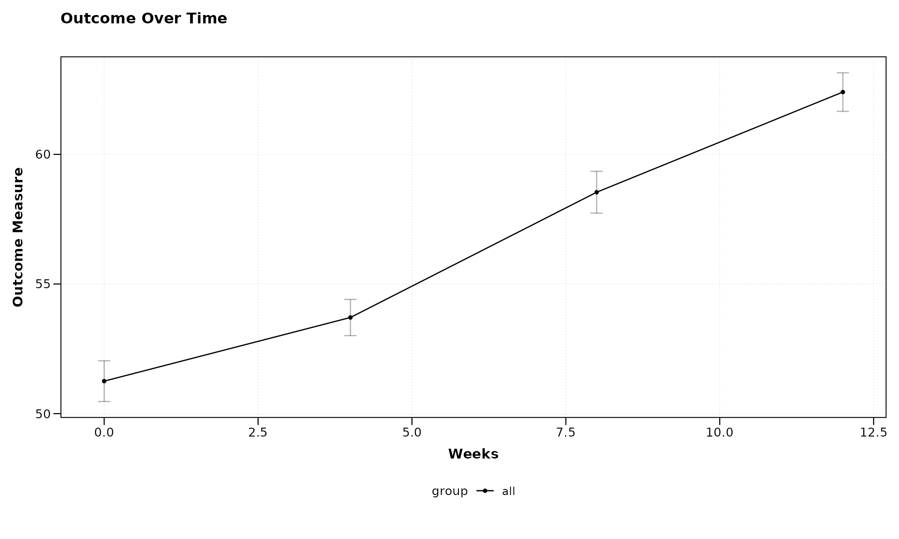

In this example, we’ve used a simple formula `outcome ~ visit_time` to
specify that we want to plot the outcome variable on the y-axis against
the visit time on the x-axis. Since we haven’t specified a grouping
variable, all subjects are plotted together.

### Adding Grouping with Formula Syntax

Now, let’s use the formula syntax to add grouping by treatment:

``` r

# Plot with grouping by treatment
lplot(continuous_data, 
      form = outcome ~ visit_time | group,
      cluster_var = "subject_id",
      baseline_value = 0,
      title = "Treatment Effect Over Time",
      xlab = "Weeks",
      ylab = "Outcome Measure")
```

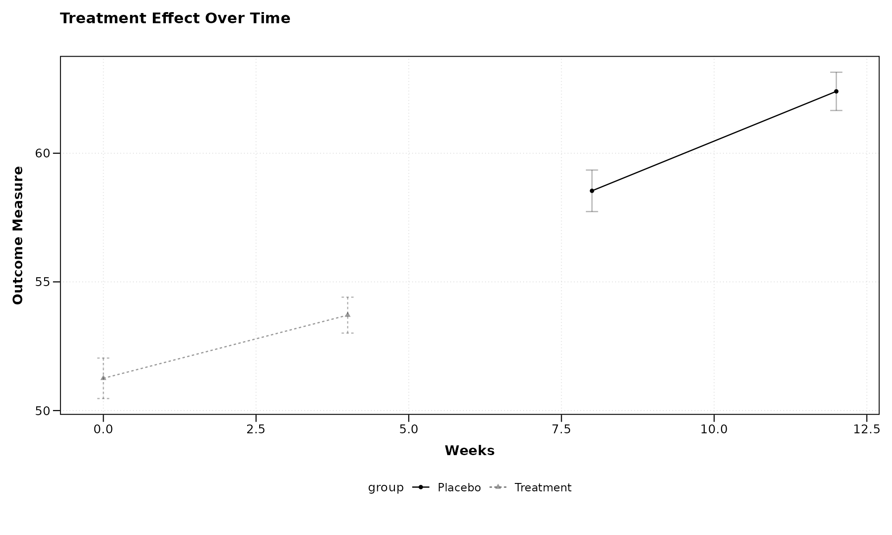

The formula `outcome ~ visit_time | group` tells `zzlongplot` to: - Plot
outcome on the y-axis - Use visit_time for the x-axis - Group and color
the lines by the “group” variable

This makes it easy to compare trajectories between different treatment
groups.

### Visualizing Change from Baseline

One of the key features of `zzlongplot` is the ability to visualize
changes from baseline. Let’s create a plot showing both observed values
and changes:

``` r

# Plot both observed values and change from baseline
lplot(continuous_data, 
      form = outcome ~ visit_time | group,
      cluster_var = "subject_id",
      baseline_value = 0,
      plot_type = "both",
      title = "Observed Outcomes",
      title2 = "Change from Baseline",
      xlab = "Weeks",
      ylab = "Outcome Measure",
      ylab2 = "Change in Outcome")
```

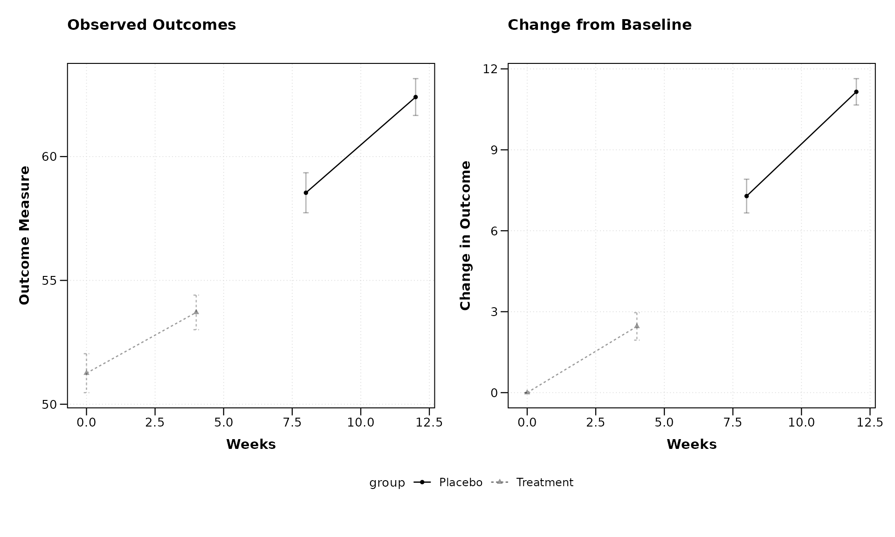

By setting `plot_type = "both"`, we get two side-by-side plots: 1. The
left plot shows the observed values 2. The right plot shows the change
from baseline

This makes it easy to see both the absolute measurements and the
relative changes in one figure.

### Working with Categorical Time Points

Now let’s demonstrate how `zzlongplot` handles categorical time points
using our second dataset.

**Important: ordering visit labels.** When the x-axis variable is
character (not numeric), R sorts levels alphabetically by default. In
this example the names happen to sort correctly (“Baseline”, “Month1”,
“Month3”, “Month6”), but visit labels such as “Screening”, “Week 12”,
“Week 4” would not. Always convert categorical visit variables to a
factor with explicit levels to guarantee the correct display order:

``` r

categorical_data$visit <- factor(
  categorical_data$visit,
  levels = c("Baseline", "Month1", "Month3", "Month6")
)
```

This controls order on the x-axis, in sample size tables, and in all
internal computations (change from baseline, statistical tests). Numeric
visit variables are sorted numerically by default and do not require
this step.

``` r

# Plot with categorical time points
lplot(categorical_data,
      form = score ~ visit | treatment,
      cluster_var = "subject_id",
      baseline_value = "Baseline",
      title = "Treatment Comparison",
      xlab = "Visit",
      ylab = "Score")
```

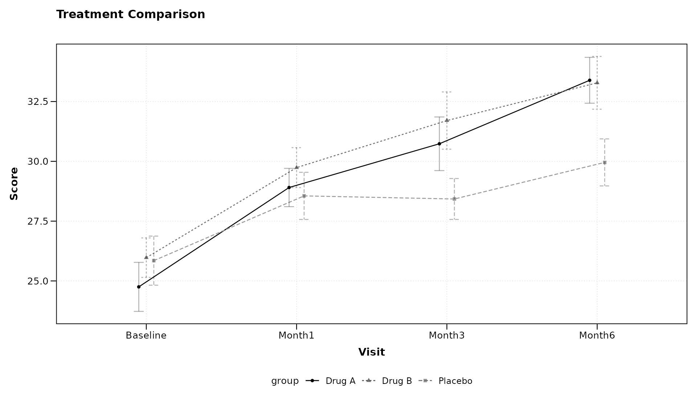

Notice that we’ve specified `baseline_value = "Baseline"` to indicate
the baseline level of our categorical variable. The formula syntax
remains the same regardless of whether the x-variable is continuous or
categorical.

### Adding Facets with Formula Syntax

`zzlongplot` supports faceting to examine how effects might differ
across another variable. Let’s add faceting by site:

``` r

# Plot with faceting by site
lplot(categorical_data, 
      form = score ~ visit | treatment,
      facet_form = ~ site,
      cluster_var = "subject_id",
      baseline_value = "Baseline",
      title = "Treatment Comparison by Site",
      xlab = "Visit",
      ylab = "Score")
```

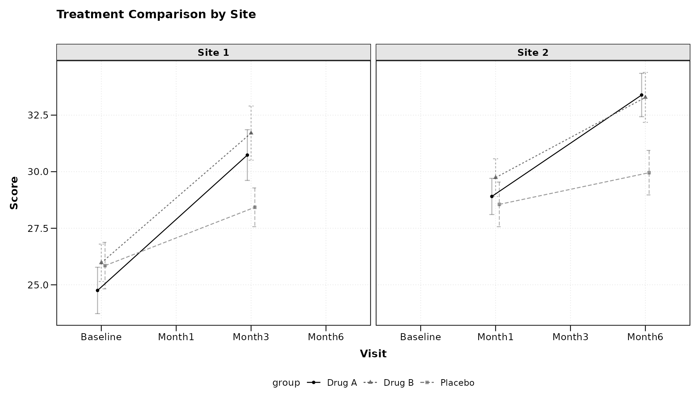

The `facet_form = ~ site` syntax tells `zzlongplot` to create separate
panels for each level of the “site” variable. This allows for easy
comparison of treatment effects across different sites.

### Customizing Error Representation

By default, `zzlongplot` uses error bars to represent standard error. We
can switch to confidence bands using the `error_type` parameter:

``` r

# Using confidence bands instead of error bars
lplot(categorical_data, 
      form = score ~ visit | treatment,
      cluster_var = "subject_id",
      baseline_value = "Baseline",
      error_type = "band",
      title = "Treatment Comparison with Confidence Bands",
      xlab = "Visit",
      ylab = "Score")
```

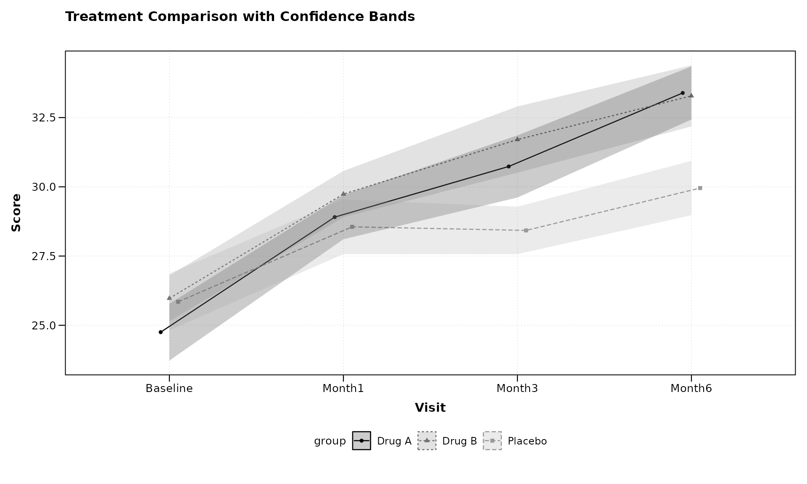

Confidence bands can sometimes provide a cleaner visualization,
especially when multiple groups are being compared.

### Using Color Palettes

`zzlongplot` includes support for custom color palettes. Let’s define
our own colorblind-friendly palette:

``` r

# Define a colorblind-friendly palette manually
# These colors are based on the ColorBrewer "Dark2" palette
custom_colors <- c("#1B9E77", "#D95F02", "#7570B3")

# Apply custom colors to the plot
lplot(categorical_data, 
      form = score ~ visit | treatment,
      cluster_var = "subject_id",
      baseline_value = "Baseline",
      color_palette = custom_colors,
      title = "Treatment Comparison with Custom Colors",
      xlab = "Visit",
      ylab = "Score")
```

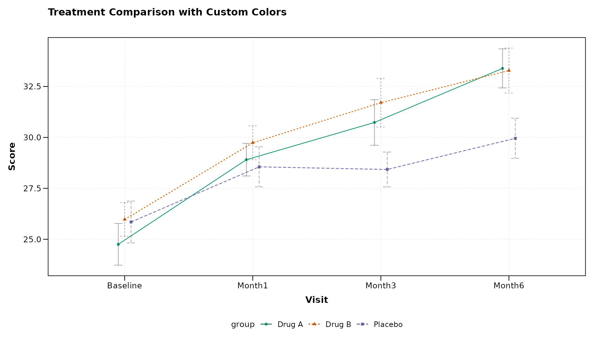

The
[`get_colorblind_palette()`](https://rgt47.github.io/zzlongplot/reference/get_colorblind_palette.md)
function provides built-in colorblind-friendly palettes, but manual
definitions work equally well for custom requirements.

This ensures that your visualizations are accessible to readers with
color vision deficiencies.

## Advanced Usage Examples

Let’s explore some more advanced use cases that demonstrate the
flexibility of `zzlongplot`.

### Complex Formula: Multiple Grouping Variables

The formula interface supports multiple grouping variables by combining
them with `+`:

``` r

# First, add a secondary grouping variable to our data
categorical_data$gender <- rep(c("Female", "Male"), length.out = nrow(categorical_data))

# Plot with two grouping variables
lplot(categorical_data, 
      form = score ~ visit | treatment + gender,
      cluster_var = "subject_id",
      baseline_value = "Baseline",
      title = "Treatment by Gender Interaction",
      xlab = "Visit",
      ylab = "Score")
```

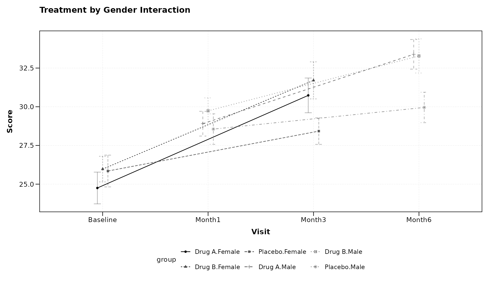

The formula `score ~ visit | treatment + gender` creates groups for each
combination of treatment and gender, allowing us to examine potential
interactions between these variables.

### Multi-facet Formula

We can also use formulas to create complex faceting arrangements:

``` r

# Add another variable for faceting
categorical_data$age_group <- rep(c("Young", "Middle", "Elder"), length.out = nrow(categorical_data))

# Create a plot with multi-dimensional faceting
lplot(categorical_data, 
      form = score ~ visit | treatment,
      facet_form = age_group ~ site,
      cluster_var = "subject_id",
      baseline_value = "Baseline",
      title = "Treatment Effects Across Age Groups and Sites",
      xlab = "Visit",
      ylab = "Score")
```

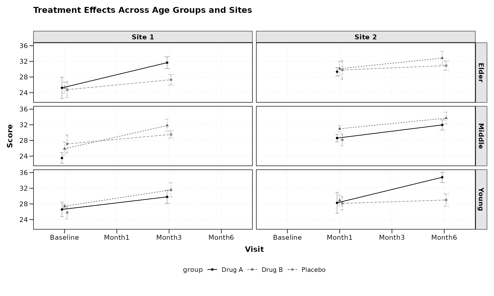

The `facet_form = age_group ~ site` syntax creates a grid of panels with
age groups as rows and sites as columns, allowing for a comprehensive
comparison across multiple dimensions.

### Custom Analysis: Non-Standard Baseline

Sometimes we might want to use a non-standard time point as our
baseline. `zzlongplot` makes this easy:

``` r

# Using a non-zero time point as baseline for continuous data
lplot(continuous_data, 
      form = outcome ~ visit_time | group,
      cluster_var = "subject_id",
      baseline_value = 4,  # Using week 4 as baseline instead of week 0
      plot_type = "both",
      title = "Outcomes (Week 4 as Baseline)",
      title2 = "Change from Week 4",
      xlab = "Weeks",
      ylab = "Outcome Measure",
      ylab2 = "Change from Week 4")
```

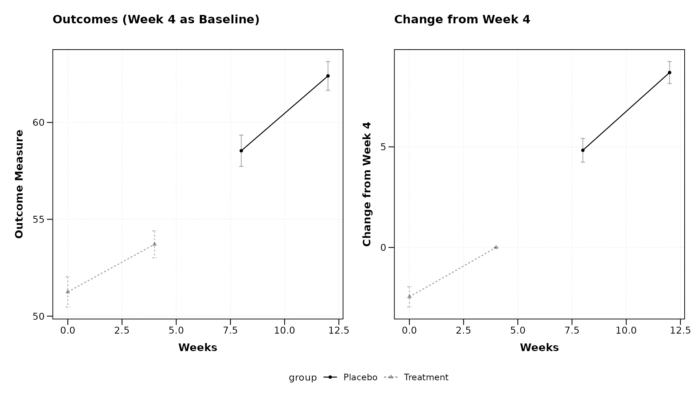

By setting `baseline_value = 4`, we’re using Week 4 as our reference
point rather than the usual Week 0. This flexibility allows for various
analysis approaches, such as examining how later measurements compare to
mid-study values.

### Clinical Trial Example with Responder Analysis

Let’s demonstrate a more complex example typical in clinical trials,
where we might want to analyze both raw scores and responder status:

``` r

# Create a clinical trial dataset
clinical_data <- data.frame(
  subject_id = rep(1:60, each = 5),
  visit_week = rep(c(0, 2, 4, 8, 12), times = 60),
  pain_score = NA,
  responder = NA,  # Will define responders as those with ≥30% improvement
  treatment = rep(c("Active", "Control"), each = 5, length.out = 300),
  site = rep(c("Site A", "Site B", "Site C"), length.out = 300)
)

# Generate pain scores (0-10 scale, higher = worse pain)
for (subject in unique(clinical_data$subject_id)) {
  subject_rows <- which(clinical_data$subject_id == subject)
  baseline <- 7 + rnorm(1, 0, 1)  # Most patients start with severe pain
  
  # Different effects for different treatments
  is_active <- clinical_data$treatment[subject_rows[1]] == "Active"
  
  # Effect sizes (pain reduction)
  if (is_active) {
    effect_size <- c(0, 1, 2, 3, 3.5)  # Stronger pain reduction
  } else {
    effect_size <- c(0, 0.5, 1, 1.2, 1.5)  # Weaker pain reduction
  }
  
  # Add individual trajectory with some random noise
  clinical_data$pain_score[subject_rows] <- pmax(0, baseline - effect_size + rnorm(5, 0, 1))
}

# Calculate responder status (≥30% improvement from baseline)
clinical_data <- clinical_data %>%
  group_by(subject_id) %>%
  mutate(
    baseline_score = pain_score[visit_week == 0],
    pct_improvement = (baseline_score - pain_score) / baseline_score * 100,
    responder = ifelse(pct_improvement >= 30, "Responder", "Non-responder")
  ) %>%
  ungroup()

# Plot pain scores over time
pain_plot <- lplot(clinical_data, 
      form = pain_score ~ visit_week | treatment,
      cluster_var = "subject_id",
      baseline_value = 0,
      title = "Pain Score Over Time",
      xlab = "Week",
      ylab = "Pain Score (0-10)")

# Calculate responder percentages
responder_data <- clinical_data %>%
  dplyr::filter(visit_week > 0) %>%  # Exclude baseline
  group_by(treatment, visit_week) %>%
  summarize(
    n_subjects = n(),
    n_responders = sum(responder == "Responder"),
    pct_responders = n_responders / n_subjects * 100,
    .groups = "drop"
  )

# Create a custom plot for responder rates
responder_plot <- ggplot(responder_data, aes(x = visit_week, y = pct_responders, color = treatment, group = treatment)) +
  geom_line() +
  geom_point(size = 3) +
  labs(title = "Responder Rates (≥30% Improvement)",
       x = "Week",
       y = "Percent of Responders",
       color = "Treatment") +
  theme_bw() +
  theme(legend.position = "bottom")

# Combine the plots using patchwork
pain_plot + responder_plot + patchwork::plot_layout(ncol = 2)
```

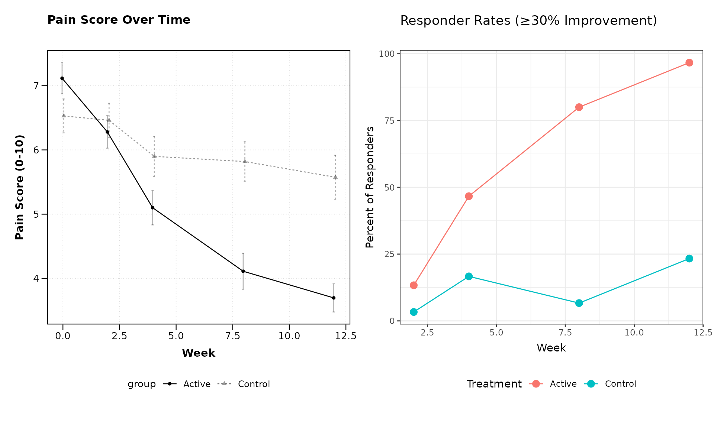

This example demonstrates how `zzlongplot` can be integrated into a more
comprehensive analysis workflow, combining standard longitudinal
visualizations with custom plots for derived endpoints.

## Formula Syntax Reference

The `zzlongplot` package uses a formula-based interface that follows
these patterns:

1.  **Basic formula**: `y ~ x`
    - `y`: The outcome or dependent variable to plot on the y-axis
    - `x`: The time or visit variable to plot on the x-axis
2.  **With grouping**: `y ~ x | group`
    - `group`: A variable used to group and color the data
3.  **With multiple grouping variables**: `y ~ x | group1 + group2`
    - Creates groups for each combination of the grouping variables
4.  **With faceting**: Use the separate `facet_form` parameter
    - `~ facet_var`: Creates columns for each level of `facet_var`
    - `facet_var ~`: Creates rows for each level of `facet_var`
    - `facet_row ~ facet_col`: Creates a grid with rows and columns

This formula syntax is designed to be intuitive for R users familiar
with model formulas, while providing the flexibility needed for complex
visualization scenarios.

## Sample Size Annotations

In clinical and research settings it is often important to display the
number of observations contributing to each plotted summary. Setting
`show_sample_sizes = TRUE` places the sample size to the right of each
point, aligned with dodge positioning when groups are present.

``` r

lplot(continuous_data,
      form = outcome ~ visit_time | group,
      cluster_var = "subject_id",
      baseline_value = 0,
      show_sample_sizes = TRUE,
      title = "Observed Values with Sample Sizes",
      xlab = "Weeks",
      ylab = "Outcome Measure")
```

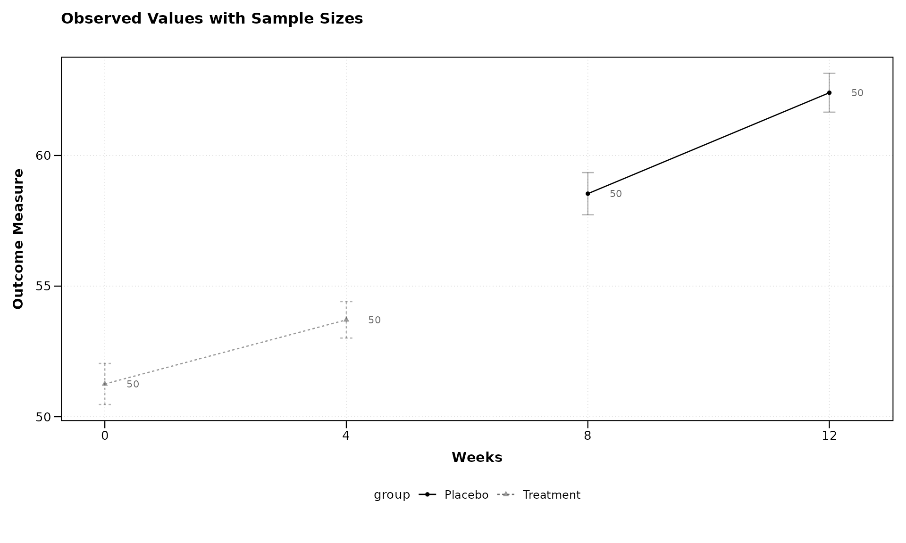

Sample size annotations also work with change-from-baseline plots and
the combined layout:

``` r

lplot(categorical_data,
      form = score ~ visit | treatment,
      cluster_var = "subject_id",
      baseline_value = "Baseline",
      show_sample_sizes = TRUE,
      plot_type = "both",
      title = "Observed Scores",
      title2 = "Change from Baseline",
      xlab = "Visit",
      ylab = "Score",
      ylab2 = "Score Change")
```

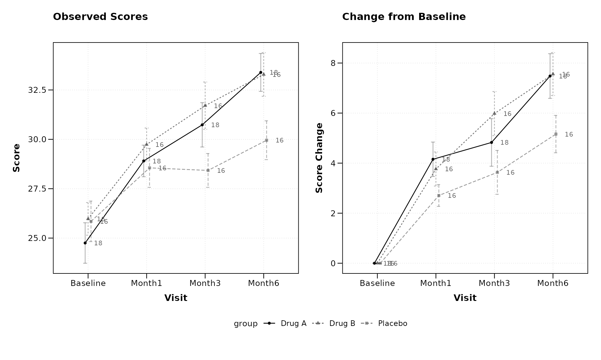

## Black-and-White Print Theme

Figures destined for monochrome printing or photocopying benefit from
visual cues beyond color. The `theme = "bw"` option applies a
high-contrast black-and-white theme and automatically maps linetype and
point shape to the grouping variable so that groups remain
distinguishable without color.

``` r

lplot(continuous_data,
      form = outcome ~ visit_time | group,
      cluster_var = "subject_id",
      baseline_value = 0,
      theme = "bw",
      title = "Treatment Effect (BW Print)",
      xlab = "Weeks",
      ylab = "Outcome Measure")
```

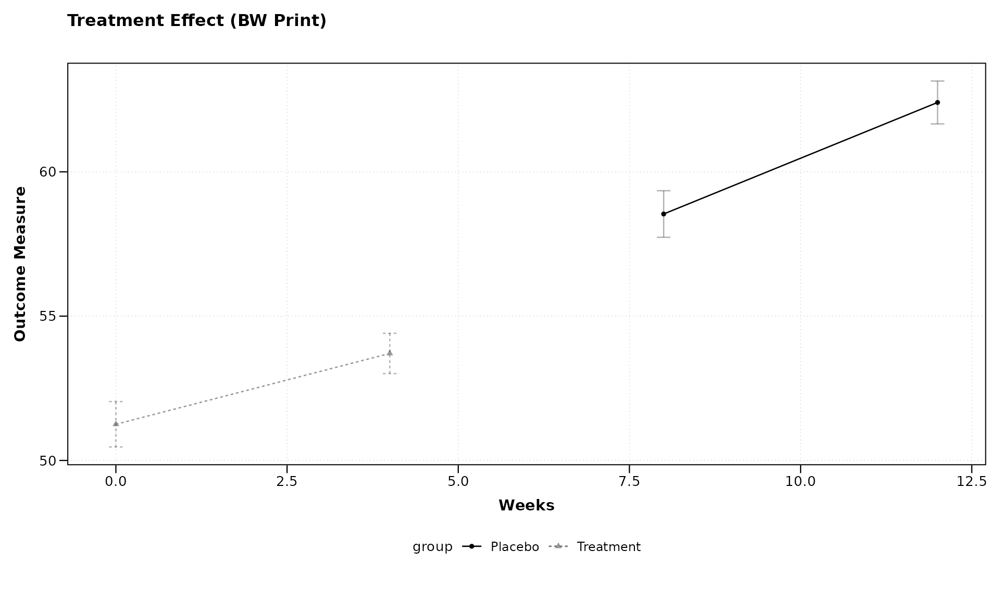

The BW theme pairs naturally with sample size annotations:

``` r

lplot(categorical_data,
      form = score ~ visit | treatment,
      cluster_var = "subject_id",
      baseline_value = "Baseline",
      theme = "bw",
      show_sample_sizes = TRUE,
      plot_type = "both",
      title = "Observed Scores (BW)",
      title2 = "Change from Baseline (BW)",
      xlab = "Visit",
      ylab = "Score",
      ylab2 = "Score Change")
```

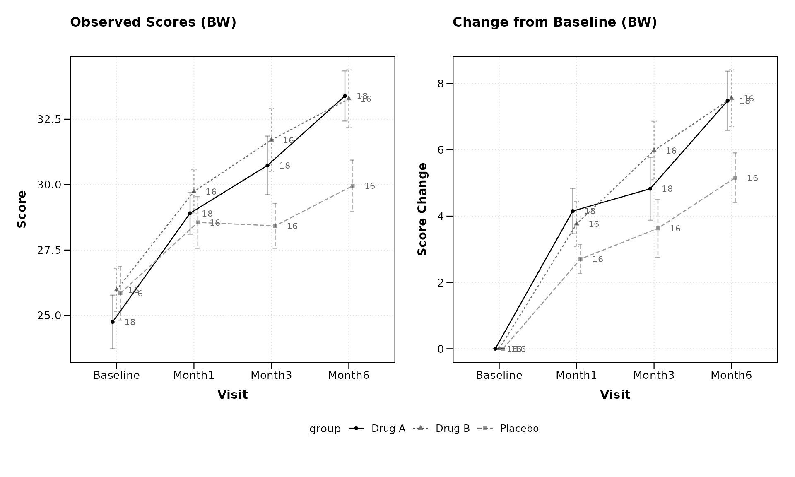

## Best Practices for Longitudinal Visualization

When using `zzlongplot` for your research, consider these best
practices:

1.  **Choose meaningful baselines**: The choice of baseline can
    significantly impact the interpretation of change values.

2.  **Consider both observed and change plots**: Observed values show
    absolute measurements, while change plots highlight relative
    differences. Both provide valuable insights.

3.  **Use appropriate error representation**: Error bars work well for
    categorical x-variables with few levels, while confidence bands may
    be preferable for continuous x-variables or when comparing many
    groups.

4.  **Apply colorblind-friendly palettes**: Ensure your visualizations
    are accessible to all readers by using appropriate color palettes,
    such as the ones from the ColorBrewer package (e.g., “Dark2” for
    categorical data).

5.  **Leverage faceting judiciously**: Faceting can reveal important
    patterns but can also make plots complex. Use it when comparing
    across important categorical variables.

6.  **Provide clear labels and titles**: Ensure your plots have
    informative axis labels, titles, and legends to guide
    interpretation.

## Conclusion

The `zzlongplot` package provides a flexible and powerful framework for
visualizing longitudinal data in R. Its formula-based interface,
combined with comprehensive options for customization, makes it an
invaluable tool for researchers working with repeated measures data
across various fields.

By following the examples and guidelines in this vignette, you can
create publication-quality visualizations that effectively communicate
patterns, trends, and group differences in your longitudinal data.

## Session Info

``` r

sessionInfo()
```

    #> R version 4.6.0 (2026-04-24)
    #> Platform: x86_64-pc-linux-gnu
    #> Running under: Ubuntu 24.04.4 LTS
    #> 
    #> Matrix products: default
    #> BLAS:   /usr/lib/x86_64-linux-gnu/openblas-pthread/libblas.so.3 
    #> LAPACK: /usr/lib/x86_64-linux-gnu/openblas-pthread/libopenblasp-r0.3.26.so;  LAPACK version 3.12.0
    #> 
    #> locale:
    #>  [1] LC_CTYPE=C.UTF-8       LC_NUMERIC=C           LC_TIME=C.UTF-8       
    #>  [4] LC_COLLATE=C.UTF-8     LC_MONETARY=C.UTF-8    LC_MESSAGES=C.UTF-8   
    #>  [7] LC_PAPER=C.UTF-8       LC_NAME=C              LC_ADDRESS=C          
    #> [10] LC_TELEPHONE=C         LC_MEASUREMENT=C.UTF-8 LC_IDENTIFICATION=C   
    #> 
    #> time zone: UTC
    #> tzcode source: system (glibc)
    #> 
    #> attached base packages:
    #> [1] stats     graphics  grDevices utils     datasets  methods   base     
    #> 
    #> other attached packages:
    #> [1] patchwork_1.3.2  ggplot2_4.0.3    dplyr_1.2.1      zzlongplot_0.2.0
    #> 
    #> loaded via a namespace (and not attached):
    #>  [1] gtable_0.3.6       jsonlite_2.0.0     compiler_4.6.0     tidyselect_1.2.1  
    #>  [5] jquerylib_0.1.4    systemfonts_1.3.2  scales_1.4.0       textshaping_1.0.5 
    #>  [9] yaml_2.3.12        fastmap_1.2.0      R6_2.6.1           labeling_0.4.3    
    #> [13] generics_0.1.4     knitr_1.51         conflicted_1.2.0   tibble_3.3.1      
    #> [17] desc_1.4.3         bslib_0.10.0       pillar_1.11.1      RColorBrewer_1.1-3
    #> [21] rlang_1.2.0        cachem_1.1.0       xfun_0.57          fs_2.1.0          
    #> [25] sass_0.4.10        S7_0.2.2           memoise_2.0.1      cli_3.6.6         
    #> [29] withr_3.0.2        pkgdown_2.2.0      magrittr_2.0.5     digest_0.6.39     
    #> [33] grid_4.6.0         lifecycle_1.0.5    vctrs_0.7.3        evaluate_1.0.5    
    #> [37] glue_1.8.1         farver_2.1.2       ragg_1.5.2         rmarkdown_2.31    
    #> [41] tools_4.6.0        pkgconfig_2.0.3    htmltools_0.5.9

------------------------------------------------------------------------

*Rendered on 2026-03-17 at 10:13 PDT.* *Source:
~/prj/sfw/01-zzlongplot/zzlongplot/vignettes/zzlongplot_introduction.Rmd*
